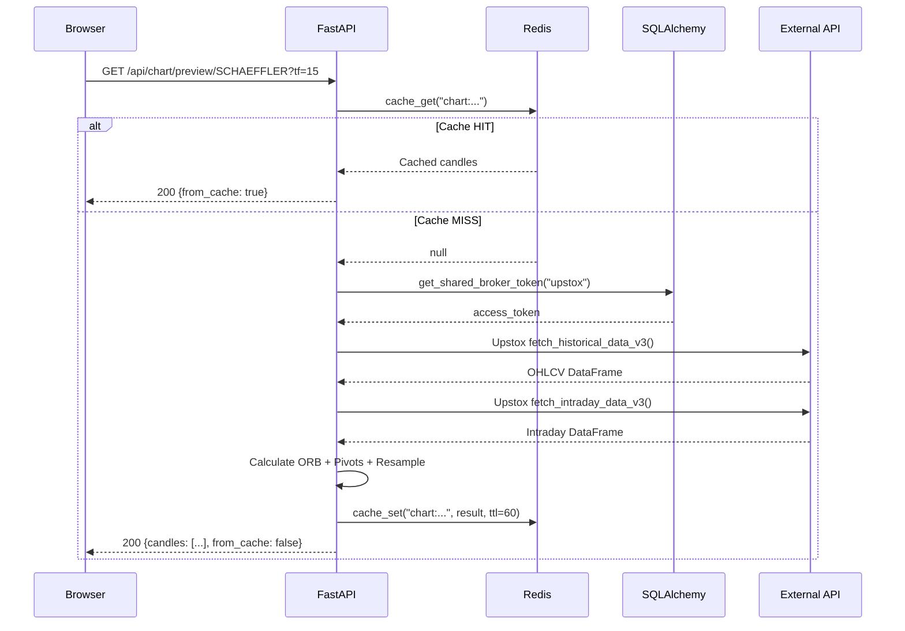
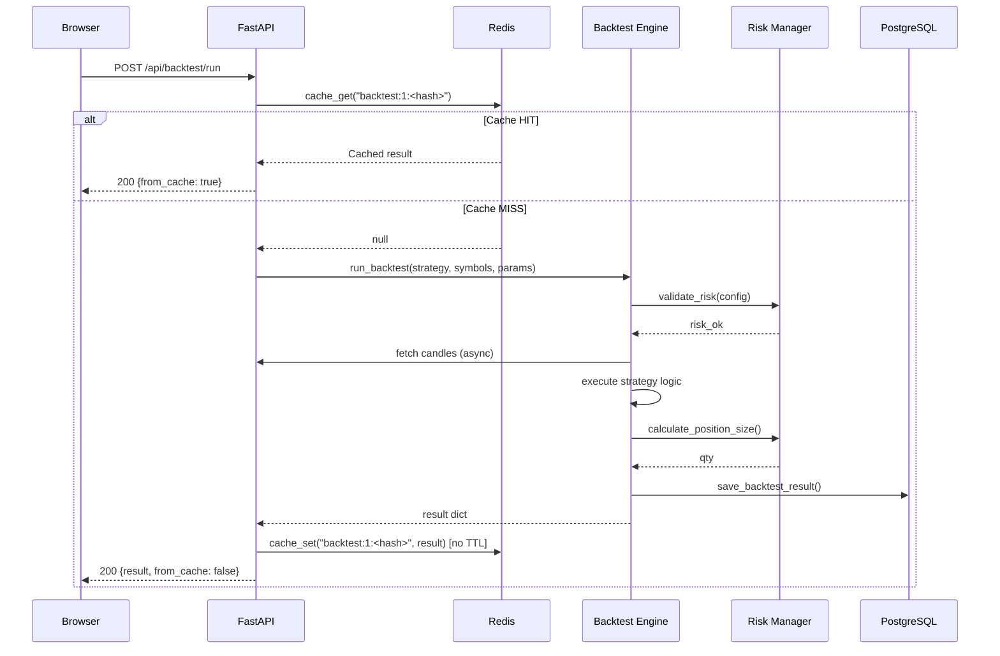
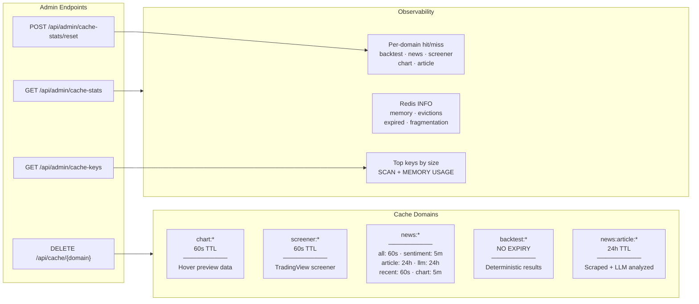
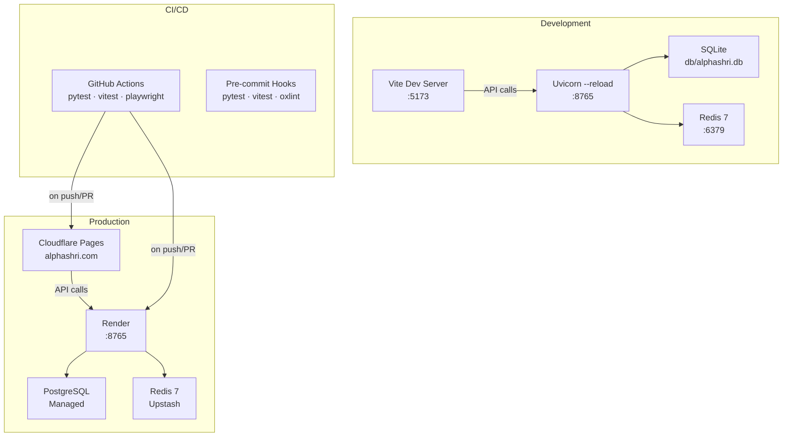

```mermaid
graph TB
    subgraph Client ["Client Layer"]
        Browser["Browser"]
        CLI["CLI / Scripts"]
    end

    subgraph Frontend ["Frontend (React + TypeScript + Vite)"]
        UI["Mantine UI Components"]
        Redux["Redux Toolkit Store"]
        Router["React Router"]
        Charts["ECharts"]
        UI --> Redux
        UI --> Charts
        Router --> UI
    end

    subgraph API ["Backend (FastAPI + Uvicorn)"]
        AuthAPI["/api/auth<br/>JWT Auth"]
        ScreenerAPI["/api/screener<br/>TradingView Screener"]
        BacktestAPI["/api/backtest<br/>Backtest Engine"]
        ChartAPI["/api/chart<br/>Upstox Candles"]
        NewsAPI["/api/news<br/>News + LLM Analysis"]
        PaperAPI["/api/paper<br/>Paper Trading"]
        OptionsAPI["/api/options<br/>Options Chain"]
        BotsAPI["/api/bots<br/>Bot Management"]
        BrokersAPI["/api/brokers<br/>Broker Connect"]
        AdminAPI["/api/admin<br/>Admin / Cache Stats"]
        WebSocket["WebSocket<br/>Real-time Updates"]
    end

     subgraph Services ["Application Services"]
         BacktestEngine["Backtest Engine<br/>Strategies: ORB, SR Breakout,<br/>52W Chaser, 52W Target"]
         RiskMgr["Risk Manager<br/>Position Sizing, Exposure"]
         PaperTrader["Paper Trader<br/>Simulated Execution"]
         TradeJournal["Trade Journal<br/>P&L Tracking"]
         NewsAnalyzer["LLM News Analyzer<br/>OpenAI / OpenRouter"]
         NewsPersistence["News Persistence<br/>Symbol Mapping + Embeddings<br/>FastEmbed (ONNX)"]
         MultiStrategy["Multi-Strategy Runner"]
     end

    subgraph Data ["Data Layer"]
        Redis["Redis 7<br/>Cache Layer"]
        SQLite["SQLite<br/>Dev Database"]
        PostgreSQL["PostgreSQL<br/>Prod Database"]
        SQLAlchemy["SQLAlchemy 2.0 ORM"]
        Models["Models: Users, Sessions,<br/>BrokerConnections, Strategies,<br/>NewsArticles, BacktestResults,<br/>BotConfigs, Instruments"]
    end

    subgraph External ["External APIs"]
        Upstox["Upstox API<br/>Historical Data, Intraday,<br/>Options Chain, Orders"]
        TradingView["TradingView Screener<br/>Stock Screening"]
        YahooFinance["yfinance<br/>Market Data"]
        OpenAI["OpenAI / OpenRouter<br/>LLM Analysis"]
        NewsSources["News Sources<br/>Moneycontrol, etc."]
    end

    subgraph Infrastructure ["Infrastructure"]
        DockerDev["Docker Compose Dev<br/>SQLite + Redis"]
        DockerProd["Docker Compose Prod<br/>PostgreSQL + Redis"]
        Cloudflare["Cloudflare Pages<br/>Frontend Hosting"]
        Render["Render<br/>Backend Hosting"]
        RedisVol["Redis Volume<br/>Persistent Data"]
    end

    Browser -->|"HTTP/WS"| Frontend
    CLI -->|"HTTP"| API
    Frontend -->|"REST API<br/>+ WebSocket"| API
    Router -->|"Route Changes"| WebSocket

    AuthAPI --> SQLAlchemy
    ScreenerAPI --> TradingView
    ScreenerAPI --> Redis
    BacktestAPI --> BacktestEngine
    BacktestAPI --> Redis
    ChartAPI --> Upstox
    ChartAPI --> Redis
    NewsAPI --> NewsAnalyzer
    NewsAPI --> NewsPersistence
    NewsAPI --> Redis
    PaperAPI --> PaperTrader
    PaperAPI --> RiskMgr
    OptionsAPI --> Upstox
    BotsAPI --> MultiStrategy
    BrokersAPI --> Upstox
    AdminAPI --> Redis
    WebSocket -->|"Push Updates"| Frontend

    BacktestEngine --> RiskMgr
    BacktestEngine --> TradeJournal
    MultiStrategy --> BacktestEngine
    MultiStrategy --> RiskMgr
    MultiStrategy --> PaperTrader
    PaperTrader --> TradeJournal
    NewsAnalyzer --> OpenAI
    NewsPersistence --> SQLAlchemy
    NewsPersistence --> NewsSources

    SQLAlchemy --> SQLite
    SQLAlchemy --> PostgreSQL
    Models --> SQLAlchemy

    Redis --> RedisVol

    DockerDev --> SQLite
    DockerDev --> Redis
    DockerProd --> PostgreSQL
    DockerProd --> Redis

    Frontend -->|"Deploy"| Cloudflare
    API -->|"Deploy"| Render

    classDef cache fill:#e74c3c,color:#fff,stroke:#c0392b
    classDef db fill:#3498db,color:#fff,stroke:#2980b9
    classDef external fill:#e67e22,color:#fff,stroke:#d35400
    classDef infra fill:#95a5a6,color:#fff,stroke:#7f8c8d
    classDef service fill:#9b59b6,color:#fff,stroke:#8e44ad
    classDef api fill:#2ecc71,color:#fff,stroke:#27ae60

    class Redis cache
    class SQLite,PostgreSQL db
    class Upstox,TradingView,YahooFinance,OpenAI,NewsSources external
    class DockerDev,DockerProd,Cloudflare,Render,RedisVol infra
    class BacktestEngine,RiskMgr,PaperTrader,TradeJournal,NewsAnalyzer,NewsPersistence,MultiStrategy service
    class AuthAPI,ScreenerAPI,BacktestAPI,ChartAPI,NewsAPI,PaperAPI,OptionsAPI,BotsAPI,BrokersAPI,AdminAPI api
```

## Data Flow — Request Lifecycle

```mermaid
sequenceDiagram
    participant B as Browser
    participant F as FastAPI
    participant R as Redis
    participant S as SQLAlchemy
    participant E as External API

    B->>F: GET /api/chart/preview/SCHAEFFLER?tf=15
    F->>R: cache_get("chart:...")
    alt Cache HIT
        R-->>F: Cached candles
        F-->>B: 200 {from_cache: true}
    else Cache MISS
        R-->>F: null
        F->>S: get_shared_broker_token("upstox")
        S-->>F: access_token
        F->>E: Upstox fetch_historical_data_v3()
        E-->>F: OHLCV DataFrame
        F->>E: Upstox fetch_intraday_data_v3()
        E-->>F: Intraday DataFrame
        F->>F: Calculate ORB + Pivots + Resample
        F->>R: cache_set("chart:...", result, ttl=60)
        F-->>B: 200 {candles: [...], from_cache: false}
    end
```

## Data Flow — Backtest Run

```mermaid
sequenceDiagram
    participant B as Browser
    participant F as FastAPI
    participant R as Redis
    participant BE as Backtest Engine
    participant RM as Risk Manager
    participant DB as PostgreSQL

    B->>F: POST /api/backtest/run
    F->>R: cache_get("backtest:1:<hash>")
    alt Cache HIT
        R-->>F: Cached result
        F-->>B: 200 {from_cache: true}
    else Cache MISS
        R-->>F: null
        F->>BE: run_backtest(strategy, symbols, params)
        BE->>RM: validate_risk(config)
        RM-->>BE: risk_ok
        BE->>F: fetch candles (async)
        BE->>BE: execute strategy logic
        BE->>RM: calculate_position_size()
        RM-->>BE: qty
        BE->>DB: save_backtest_result()
        BE-->>F: result dict
        F->>R: cache_set("backtest:1:<hash>", result) [no TTL]
        F-->>B: 200 {result, from_cache: false}
    end
```

## Cache Architecture

```mermaid
graph LR
    subgraph Domains ["Cache Domains"]
        direction TB
        Chart["chart:*<br/>60s TTL<br/>──────────<br/>Hover preview data"]
        Screener["screener:*<br/>60s TTL<br/>──────────<br/>TradingView screener"]
        News["news:*<br/>──────────<br/>all: 60s · sentiment: 5m<br/>article: 24h · llm: 24h<br/>recent: 60s · chart: 5m"]
        Backtest["backtest:*<br/>NO EXPIRY<br/>──────────<br/>Deterministic results"]
        Article["news:article:*<br/>24h TTL<br/>──────────<br/>Scraped + LLM analyzed"]
    end

    subgraph Stats ["Observability"]
        PerDomain["Per-domain hit/miss<br/>backtest · news · screener<br/>chart · article"]
        RedisInfo["Redis INFO<br/>memory · evictions<br/>expired · fragmentation"]
        KeyScan["Top keys by size<br/>SCAN + MEMORY USAGE"]
    end

    subgraph Admin ["Admin Endpoints"]
        StatsEP["GET /api/admin/cache-stats"]
        KeysEP["GET /api/admin/cache-keys"]
        ResetEP["POST /api/admin/cache-stats/reset"]
        InvalidateEP["DELETE /api/cache/{domain}"]
    end

    InvalidateEP --> Domains
    StatsEP --> Stats
    KeysEP --> KeyScan
    ResetEP --> PerDomain
```

## Deployment Architecture

```mermaid
graph TB
    subgraph Dev ["Development"]
        DVite["Vite Dev Server<br/>:5173"]
        DBackend["Uvicorn --reload<br/>:8765"]
        DSQLite["SQLite<br/>db/alphashri.db"]
        DRedis["Redis 7<br/>:6379"]
        DVite -->|"API calls"| DBackend
        DBackend --> DSQLite
        DBackend --> DRedis
    end

    subgraph Prod ["Production"]
        CF["Cloudflare Pages<br/>alphashri.com"]
        Render["Render<br/>:8765"]
        RPG["PostgreSQL<br/>Managed"]
        RRedis["Redis 7<br/>Upstash"]
        CF -->|"API calls"| Render
        Render --> RPG
        Render --> RRedis
    end

    subgraph CI_CD ["CI/CD"]
        GitHubActions["GitHub Actions<br/>pytest · vitest · playwright"]
        PreCommit["Pre-commit Hooks<br/>pytest · vitest · oxlint"]
    end

    GitHubActions -->|"on push/PR"| CF
    GitHubActions -->|"on push/PR"| Render
```
