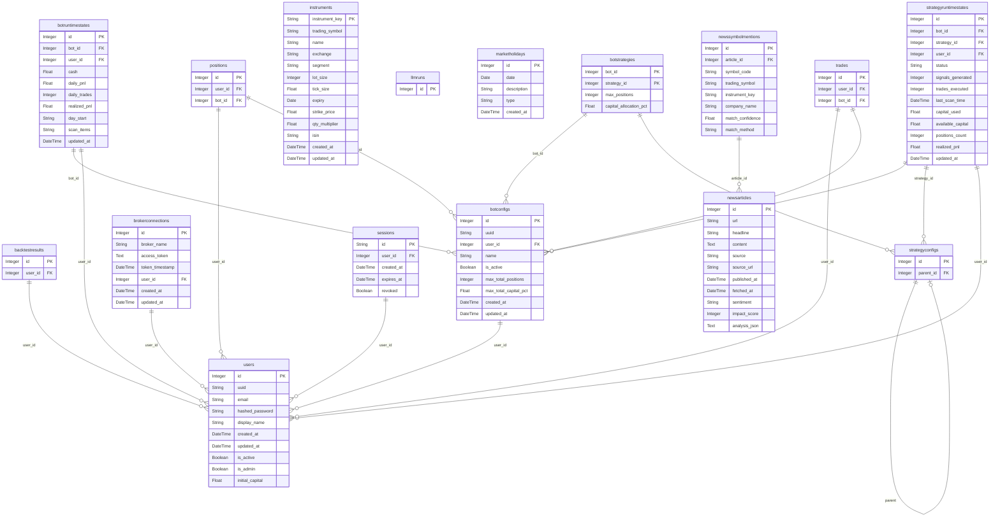

# Database Schema

> Auto-generated from `db/models.py`. Do not edit manually.
> Regenerate with: `python scripts/generate_schema_docs.py`

## Entity Relationship Diagram

## Table Reference

### backtest_results

| Column | Type | Nullable | Key |
|--------|------|----------|-----|
| id | Integer | No | PK |
| uuid | String | Yes | UNIQUE |
| user_id | Integer | No | FK -> users.id |
| strategy_id | String | No | - |
| strategy_name | String | No | - |
| variation_id | String | Yes | - |
| parameters | String | No | - |
| symbols | String | No | - |
| total_pnl | Float | Yes | - |
| total_pnl_pct | Float | Yes | - |
| win_rate | Float | Yes | - |
| total_trades | Integer | Yes | - |
| sharpe_ratio | Float | Yes | - |
| max_drawdown_pct | Float | Yes | - |
| results_json | String | No | - |
| totals_json | String | No | - |
| chart_data_json | String | Yes | - |
| created_at | DateTime | Yes | - |
| *(Index: `ix_backtest_results_user_id` on user_id)* | | | |

### bot_configs

| Column | Type | Nullable | Key |
|--------|------|----------|-----|
| id | Integer | No | PK |
| uuid | String | Yes | UNIQUE |
| user_id | Integer | No | FK -> users.id |
| name | String | No | - |
| is_active | Boolean | Yes | - |
| max_total_positions | Integer | Yes | - |
| max_total_capital_pct | Float | Yes | - |
| created_at | DateTime | Yes | - |
| updated_at | DateTime | Yes | - |
| *(Index: `ix_bot_configs_user_id` on user_id)* | | | |
| *(Unique: `uq_bot_name_per_user` on name, user_id)* | | | |

### bot_runtime_states

| Column | Type | Nullable | Key |
|--------|------|----------|-----|
| id | Integer | No | PK |
| bot_id | Integer | No | UNIQUE FK -> bot_configs.id |
| user_id | Integer | No | FK -> users.id |
| cash | Float | No | - |
| daily_pnl | Float | No | - |
| daily_trades | Integer | No | - |
| realized_pnl | Float | No | - |
| day_start | String | No | - |
| scan_items | String | Yes | - |
| updated_at | DateTime | No | - |
| *(Index: `ix_bot_runtime_states_user_id` on user_id)* | | | |

### bot_strategies

| Column | Type | Nullable | Key |
|--------|------|----------|-----|
| bot_id | Integer | No | PK FK -> bot_configs.id |
| strategy_id | Integer | No | PK FK -> strategy_configs.id |
| max_positions | Integer | Yes | - |
| capital_allocation_pct | Float | Yes | - |

### broker_connections

| Column | Type | Nullable | Key |
|--------|------|----------|-----|
| id | Integer | No | PK |
| broker_name | String | No | - |
| access_token | Text | No | - |
| token_timestamp | DateTime | No | - |
| user_id | Integer | Yes | FK -> users.id |
| created_at | DateTime | Yes | - |
| updated_at | DateTime | Yes | - |
| *(Index: `ix_broker_connections_broker_name` on broker_name)* | | | |
| *(Index: `ix_broker_connections_user_id` on user_id)* | | | |
| *(Unique: `uq_broker_name_user` on broker_name, user_id)* | | | |

### instruments

| Column | Type | Nullable | Key |
|--------|------|----------|-----|
| instrument_key | String | No | PK |
| trading_symbol | String | No | - |
| name | String | Yes | - |
| exchange | String | No | - |
| segment | String | No | - |
| lot_size | Integer | Yes | - |
| tick_size | Float | Yes | - |
| expiry | Date | Yes | - |
| strike_price | Float | Yes | - |
| qty_multiplier | Float | Yes | - |
| isin | String | Yes | - |
| created_at | DateTime | Yes | - |
| updated_at | DateTime | Yes | - |
| *(Index: `ix_instruments_trading_symbol` on trading_symbol)* | | | |

### llm_runs

| Column | Type | Nullable | Key |
|--------|------|----------|-----|
| id | Integer | No | PK |
| uuid | String | Yes | UNIQUE |
| model | String | No | - |
| provider | String | Yes | - |
| prompt_tokens | Integer | Yes | - |
| completion_tokens | Integer | Yes | - |
| total_tokens | Integer | Yes | - |
| cost_usd | Float | Yes | - |
| response_time_ms | Integer | Yes | - |
| status | String | Yes | - |
| error_message | Text | Yes | - |
| url | String | Yes | - |
| headline | String | Yes | - |
| request_json | Text | Yes | - |
| response_json | Text | Yes | - |
| created_at | DateTime | Yes | - |
| *(Index: `ix_llm_runs_created_at` on created_at)* | | | |
| *(Index: `ix_llm_runs_model` on model)* | | | |
| *(Index: `ix_llm_runs_status` on status)* | | | |

### market_holidays

| Column | Type | Nullable | Key |
|--------|------|----------|-----|
| id | Integer | No | PK |
| date | Date | No | UNIQUE |
| description | String | No | - |
| type | String | No | - |
| created_at | DateTime | Yes | - |
| *(Unique: `uq_market_holiday_date` on date)* | | | |

### news_articles

| Column | Type | Nullable | Key |
|--------|------|----------|-----|
| id | Integer | No | PK |
| url | String | No | UNIQUE |
| headline | String | No | - |
| content | Text | Yes | - |
| source | String | No | - |
| source_url | String | Yes | - |
| published_at | DateTime | Yes | - |
| fetched_at | DateTime | Yes | - |
| sentiment | String | Yes | - |
| impact_score | Integer | Yes | - |
| analysis_json | Text | Yes | - |
| *(Index: `ix_news_articles_fetched_at` on fetched_at)* | | | |
| *(Index: `ix_news_articles_published_at` on published_at)* | | | |
| *(Index: `ix_news_articles_source` on source)* | | | |

### news_symbol_mentions

| Column | Type | Nullable | Key |
|--------|------|----------|-----|
| id | Integer | No | PK |
| article_id | Integer | No | FK -> news_articles.id |
| symbol_code | String | No | - |
| trading_symbol | String | Yes | - |
| instrument_key | String | Yes | - |
| company_name | String | Yes | - |
| match_confidence | Float | Yes | - |
| match_method | String | Yes | - |
| *(Index: `ix_news_symbol_mentions_article_id` on article_id)* | | | |
| *(Index: `ix_news_symbol_mentions_instrument_key` on instrument_key)* | | | |
| *(Index: `ix_news_symbol_mentions_trading_symbol` on trading_symbol)* | | | |

### positions

| Column | Type | Nullable | Key |
|--------|------|----------|-----|
| id | Integer | No | PK |
| uuid | String | No | UNIQUE |
| user_id | Integer | No | FK -> users.id |
| bot_id | Integer | No | FK -> bot_configs.id |
| strategy_id | Integer | Yes | - |
| strategy_name | String | No | - |
| symbol | String | No | - |
| side | String | No | - |
| quantity | Integer | No | - |
| entry_price | Float | No | - |
| stop_loss | Float | Yes | - |
| take_profit | Float | Yes | - |
| entry_time | DateTime | No | - |
| current_price | Float | Yes | - |
| unrealized_pnl | Float | Yes | - |
| unrealized_pnl_pct | Float | Yes | - |
| is_test | Boolean | No | - |
| created_at | DateTime | No | - |
| updated_at | DateTime | No | - |
| strategy_type | String | Yes | - |
| peak_price | Float | Yes | - |
| low_price | Float | Yes | - |
| metadata_json | String | Yes | - |
| *(Index: `ix_positions_bot_id` on bot_id)* | | | |
| *(Index: `ix_positions_strategy_id` on strategy_id)* | | | |
| *(Index: `ix_positions_symbol` on symbol)* | | | |
| *(Index: `ix_positions_user_id` on user_id)* | | | |
| *(Unique: `uq_bot_strategy_symbol` on bot_id, strategy_id, symbol)* | | | |

### sessions

| Column | Type | Nullable | Key |
|--------|------|----------|-----|
| id | String | No | PK |
| user_id | Integer | No | FK -> users.id |
| created_at | DateTime | Yes | - |
| expires_at | DateTime | No | - |
| revoked | Boolean | Yes | - |
| *(Index: `ix_sessions_user_id` on user_id)* | | | |

### strategy_configs

| Column | Type | Nullable | Key |
|--------|------|----------|-----|
| id | Integer | No | PK |
| uuid | String | Yes | UNIQUE |
| name | String | No | UNIQUE |
| strategy_type | String | No | - |
| parent_id | Integer | Yes | FK -> strategy_configs.id |
| is_template | Boolean | Yes | - |
| is_active | Boolean | Yes | - |
| is_default | Boolean | Yes | - |
| description | String | Yes | - |
| or_minutes | Integer | Yes | - |
| sl_pct | Float | Yes | - |
| tp_pct | Float | Yes | - |
| min_or_range_pct | Float | Yes | - |
| max_or_range_pct | Float | Yes | - |
| max_positions | Integer | Yes | - |
| max_capital_per_trade_pct | Float | Yes | - |
| max_daily_loss_pct | Float | Yes | - |
| max_total_exposure_pct | Float | Yes | - |
| risk_per_trade_pct | Float | Yes | - |
| min_trade_value | Float | Yes | - |
| max_trade_value | Float | Yes | - |
| cooldown_minutes | Integer | Yes | - |
| max_distance_from_or_pct | Float | Yes | - |
| entry_threshold_pct | Float | Yes | - |
| enable_trailing_stop | Boolean | Yes | - |
| trailing_stop_pct | Float | Yes | - |
| trailing_activation_pct | Float | Yes | - |
| max_holding_days | Integer | Yes | - |
| cooldown_days | Integer | Yes | - |
| enable_filters | Boolean | Yes | - |
| ema_fast_period | Integer | Yes | - |
| ema_slow_period | Integer | Yes | - |
| pivot_type | String | Yes | - |
| breakout_buffer_pct | Float | Yes | - |
| enable_shorts | Boolean | Yes | - |
| eod_exit_hour | Integer | Yes | - |
| eod_exit_minute | Integer | Yes | - |
| min_rr_ratio | Float | Yes | - |
| screener_profiles | String | Yes | - |
| brokerage_pct | Float | Yes | - |
| min_brokerage | Float | Yes | - |
| stt_pct | Float | Yes | - |
| exchange_pct | Float | Yes | - |
| sebi_pct | Float | Yes | - |
| stamp_pct | Float | Yes | - |
| gst_pct | Float | Yes | - |
| created_at | DateTime | Yes | - |
| updated_at | DateTime | Yes | - |

### strategy_runtime_states

| Column | Type | Nullable | Key |
|--------|------|----------|-----|
| id | Integer | No | PK |
| bot_id | Integer | No | FK -> bot_configs.id |
| strategy_id | Integer | No | FK -> strategy_configs.id |
| user_id | Integer | No | FK -> users.id |
| status | String | No | - |
| signals_generated | Integer | No | - |
| trades_executed | Integer | No | - |
| last_scan_time | DateTime | Yes | - |
| capital_used | Float | No | - |
| available_capital | Float | No | - |
| positions_count | Integer | No | - |
| realized_pnl | Float | No | - |
| updated_at | DateTime | No | - |
| *(Index: `ix_strategy_runtime_states_bot_id` on bot_id)* | | | |
| *(Index: `ix_strategy_runtime_states_strategy_id` on strategy_id)* | | | |
| *(Unique: `uq_bot_strategy_runtime` on bot_id, strategy_id)* | | | |

### trades

| Column | Type | Nullable | Key |
|--------|------|----------|-----|
| id | Integer | No | PK |
| uuid | String | No | UNIQUE |
| user_id | Integer | No | FK -> users.id |
| bot_id | Integer | Yes | FK -> bot_configs.id |
| strategy_id | Integer | Yes | - |
| strategy_name | String | No | - |
| symbol | String | No | - |
| side | String | No | - |
| quantity | Integer | No | - |
| entry_price | Float | No | - |
| exit_price | Float | Yes | - |
| entry_time | DateTime | No | - |
| exit_time | DateTime | Yes | - |
| stop_loss | Float | Yes | - |
| take_profit | Float | Yes | - |
| pnl | Float | Yes | - |
| pnl_pct | Float | Yes | - |
| costs | Float | Yes | - |
| net_pnl | Float | Yes | - |
| exit_reason | String | Yes | - |
| notes | String | Yes | - |
| reason | String | Yes | - |
| peak_price | Float | Yes | - |
| low_price | Float | Yes | - |
| is_test | Boolean | No | - |
| source | String | No | - |
| created_at | DateTime | No | - |
| *(Index: `ix_trades_bot_id` on bot_id)* | | | |
| *(Index: `ix_trades_strategy_id` on strategy_id)* | | | |
| *(Index: `ix_trades_symbol` on symbol)* | | | |
| *(Index: `ix_trades_user_id` on user_id)* | | | |

### users

| Column | Type | Nullable | Key |
|--------|------|----------|-----|
| id | Integer | No | PK |
| uuid | String | Yes | UNIQUE |
| email | String | No | UNIQUE |
| hashed_password | String | No | - |
| display_name | String | Yes | - |
| created_at | DateTime | Yes | - |
| updated_at | DateTime | Yes | - |
| is_active | Boolean | Yes | - |
| is_admin | Boolean | Yes | - |
| initial_capital | Float | Yes | - |

