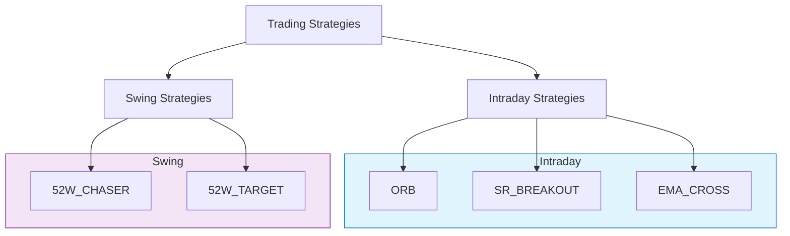
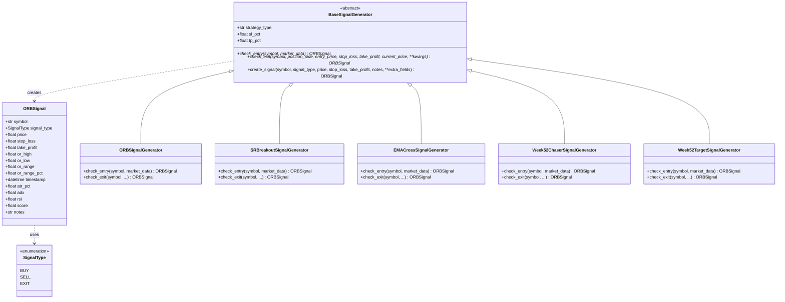
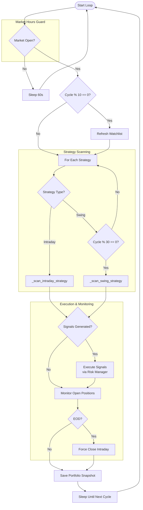
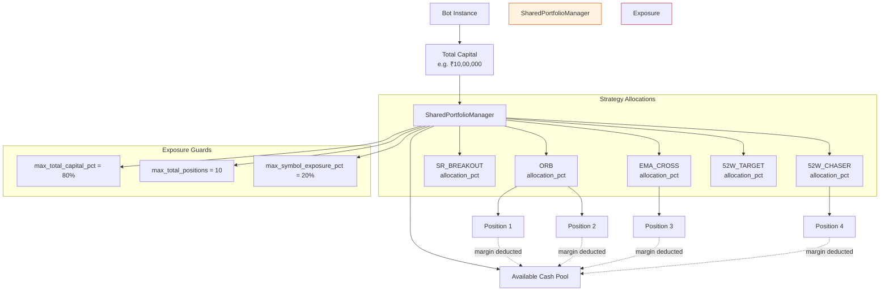
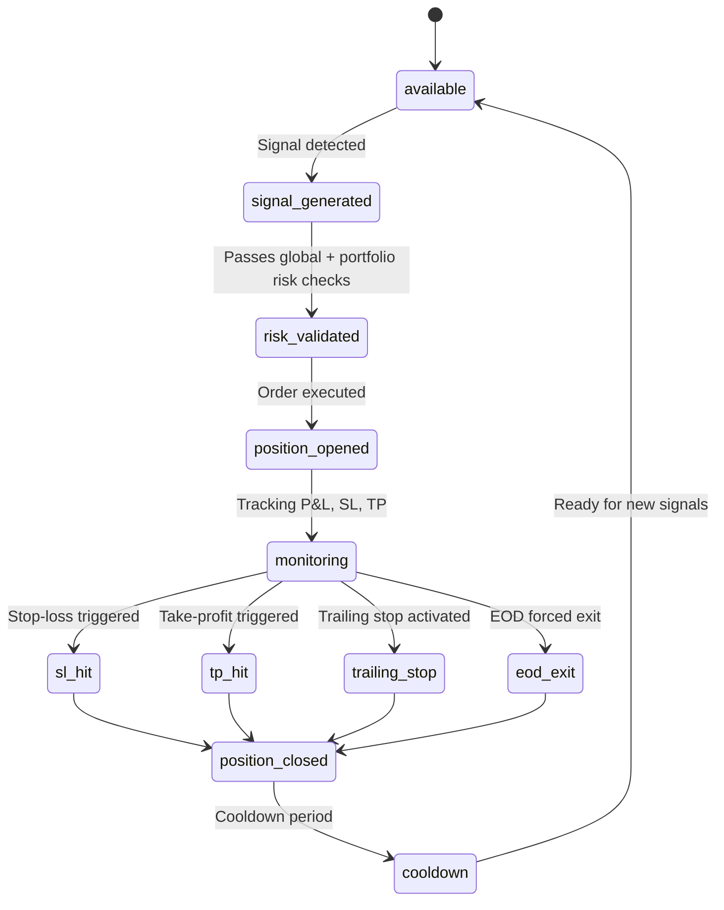
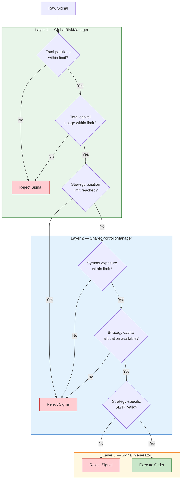

# Trading Strategies Overview

## Architecture Overview

The multi-strategy system runs multiple trading strategies concurrently from a single bot instance. A `SharedPortfolioManager` holds a unified capital pool, while each strategy receives a proportional allocation. The `MultiStrategyRunner` orchestrates scanning, signal generation, risk validation, and position monitoring in a continuous loop during market hours.

Strategies are classified into two categories — **Intraday** (enter and exit within the same trading day) and **Swing** (hold positions across multiple days). Each category shares scanning cadence, candle timeframe, and exit semantics, but differs in risk parameters and position duration.

## Strategy Classification

| Category | Scan Cadence | Candle Timeframe | Exit Policy |
|----------|-------------|-----------------|-------------|
| Intraday | Every cycle (~1 min) | 5-minute | EOD forced exit |
| Swing | Every 30 cycles (~30 min) | Daily | Multi-day hold |

## Strategy Comparison Table

| Strategy | Type | Direction | Entry Logic | Default SL | Default TP | Timeframe | Key Feature |
|----------|------|-----------|-------------|------------|------------|-----------|-------------|
| ORB | Intraday | Long + Short | Opening Range breakout | 0.4% | 1.2% | 5 min | Opening range detection |
| SR_BREAKOUT | Intraday | Long + Short | Pivot breakout | 0.5% | 1.5% | Daily → Intraday | Support/Resistance levels |
| EMA_CROSS | Intraday | Long + Short | EMA crossover | 0.5% | 1.5% | 5 min | Trend following |
| 52W_CHASER | Swing | Long Only | 52-week high proximity | 3% | 5% | Daily | Optional trailing stop |
| 52W_TARGET | Swing | Long Only | 52-week high proximity | 2% | None (trailing) | Daily | Always-on trailing stop |

## Signal Generator Hierarchy

All signal generators inherit from `BaseSignalGenerator`, which defines the contract via two abstract methods: `check_entry` and `check_exit`. Each concrete generator implements strategy-specific logic and shares the `ORBSignal` data class for uniform signal representation.

## Multi-Strategy Runner Flow

The main loop in `MultiStrategyRunner` runs continuously during market hours. It differentiates between intraday and swing strategies, applying different scan cadences.

## Capital Allocation

`SharedPortfolioManager` holds a single capital pool. Each strategy is assigned an `allocation_pct` of the total capital. When a strategy opens a position, the required margin is deducted from the shared cash pool, ensuring strategies compete for capital and total exposure stays within limits.

## Position Lifecycle

Every position follows a deterministic lifecycle from signal generation through closure and cooldown.

## Risk Management Layers

Risk is enforced at three distinct layers, each with progressively narrower scope. A signal must pass all layers before a position is opened.

## Strategy Links

- [ORB Strategy](strategy-orb.md)
- [S/R Breakout Strategy](strategy-sr-breakout.md)
- [52-Week Chaser Strategy](strategy-52w-chaser.md)
- [52-Week Target Strategy](strategy-52w-target.md)
- [EMA Crossover Strategy](strategy-ema-cross.md)
