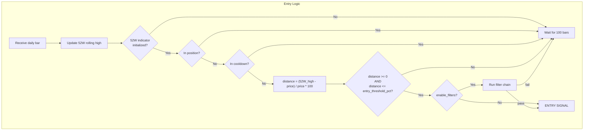
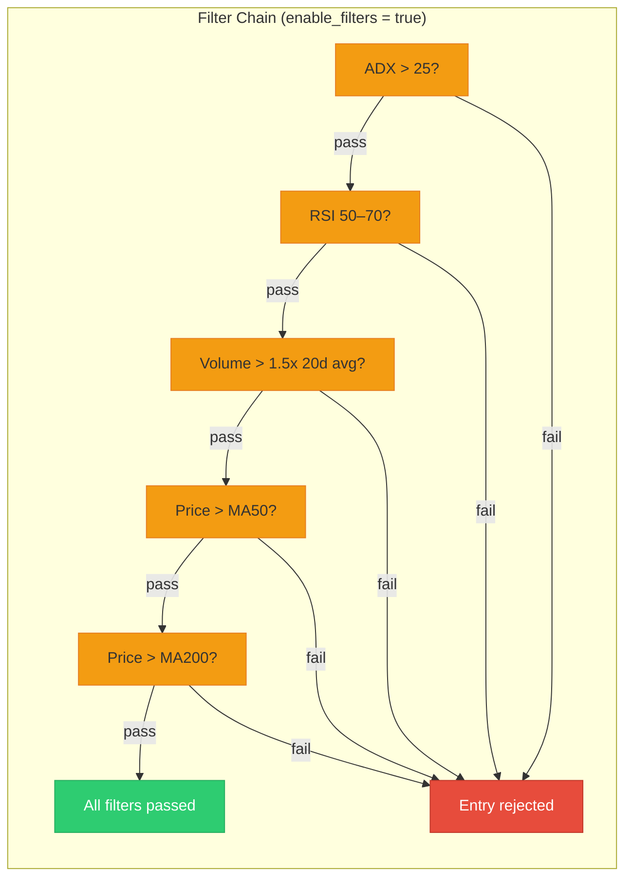
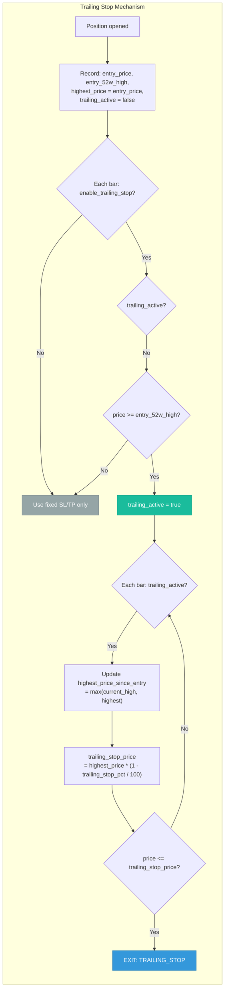
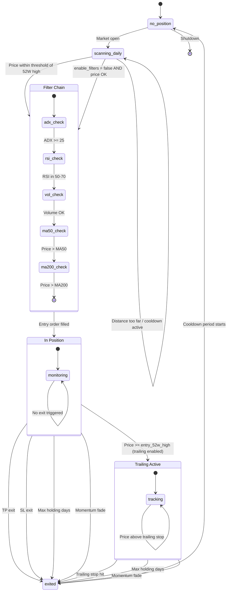
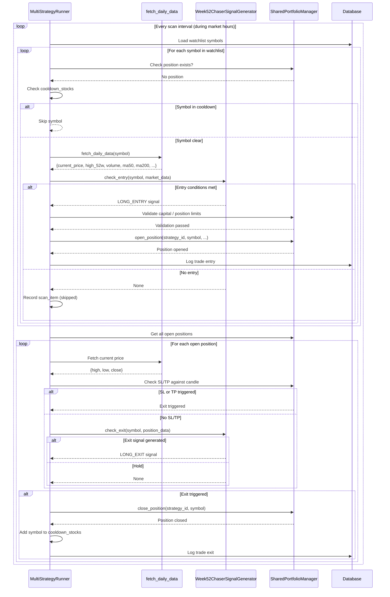

# 52-Week Chaser — Swing Strategy

## Overview

The **52-Week Chaser** is a long-only swing strategy that buys stocks approaching or breaking through their 52-week rolling highs. It operates on daily timeframes and is designed to capture momentum as stocks challenge new highs. Entries are triggered when the current price is within a configurable threshold of the rolling 252-day high. Exits are managed through a layered system of stop-loss, take-profit, optional trailing stop, max holding period, and a momentum-fade detection mechanism.

**Strategy identifier:** `52W_CHASER`

**Core philosophy:** Stocks near 52-week highs tend to continue trending higher. The strategy enters when price proximity signals renewed buying interest, then protects capital with tight risk management.

## Strategy Type

| Attribute | Value |
|---|---|
| Direction | Long only |
| Timeframe | Daily (swing) |
| Market | Indian equities (NSE) |
| Typical hold | 1–30 days |
| Data requirement | 400+ daily bars for indicator warmup |

## Parameters

| Parameter | Key | Type | Default | Range | Description |
|---|---|---|---|---|---|
| Entry Threshold % | `entry_threshold_pct` | float | 3.0 | 1.0–10.0 | Max distance from 52W high to trigger entry. Lower = stricter. |
| Stop Loss % | `sl_pct` | float | 3.0 | 1.0–8.0 | Fixed stop-loss below entry price. |
| Take Profit % | `tp_pct` | float | 5.0 | 1.0–15.0 | Fixed take-profit above entry price (used when trailing is off or before activation). |
| Enable Trailing Stop | `enable_trailing_stop` | bool | false | — | Activate trailing stop mechanism after price reaches 52W high. |
| Trailing Stop % | `trailing_stop_pct` | float | 3.0 | 1.0–5.0 | Percentage below highest price since entry for the trailing stop. |
| Trailing Activation % | `trailing_activation_pct` | float | 2.0 | 0.5–5.0 | Price must exceed entry 52W high by this % to activate trailing. |
| Max Holding Days | `max_holding_days` | int | 30 | 10–60 | Force exit after this many bars in position. |
| Cooldown Days | `cooldown_days` | int | 30 | 10–60 | Days after exit before re-entering the same symbol. |
| Enable Filters | `enable_filters` | bool | false | — | Apply ADX, RSI, volume, and moving average filters to entries. |
| Trade Size | `trade_size` | int | 100 | 1–1000 | Number of shares per trade (backtest only). |

**Validation rules:**
- `sl_pct` must be less than `tp_pct`
- `entry_threshold_pct` must be positive
- `trailing_stop_pct` must be positive when trailing is enabled

## Entry Conditions



**Core condition:** Price must be within `entry_threshold_pct` (default 3%) of the rolling 52-week high, and distance must be non-negative (price at or below the 52W high).

The 52-week high is computed as the maximum high price over the rolling window of 252 trading days, excluding the current bar to prevent look-ahead bias.

## Optional Filters

When `enable_filters = true`, all five filters must pass for an entry to be valid. Any single filter failure rejects the trade.

| Filter | Condition | Purpose |
|---|---|---|
| ADX | `> 25` | Confirms a strong trend is in place |
| RSI | `50–70` | Ensures momentum room — not overbought, not oversold |
| Volume | `> 1.5 × 20-day avg` | Requires above-average participation |
| MA50 | `price > MA50` | Price above intermediate trend |
| MA200 | `price > MA200` | Price above long-term trend |



Note: Filters use pre-calculated indicator values from historical data (backtest) or live market data (signal generator). If any indicator value is `None`, that filter is skipped (not failed).

## Exit Conditions

Exits are evaluated in strict priority order. The first matching condition triggers the exit.

| Priority | Exit Type | Condition | When Active |
|---|---|---|---|
| 1 | **Take Profit** | `pnl_pct >= tp_pct` | Trailing stop NOT active |
| 2 | **Trailing Stop** | `price <= highest_price * (1 - trailing_stop_pct / 100)` | Trailing stop enabled AND activated |
| 3 | **Stop Loss** | `pnl_pct <= -sl_pct` | Trailing stop NOT active |
| 4 | **Max Holding** | `bars_in_trade >= max_holding_days` | Always |
| 5 | **Momentum Fade** | `current_52w_high > entry_52w_high * 1.10` | Always |

**Key detail:** When trailing stop is active, the fixed SL and TP checks are bypassed — only the trailing stop, max holding, and momentum fade conditions apply.

```mermaid
flowchart TD
    subgraph EXIT["Exit Evaluation (per bar, in position)"]
        direction TB
        E0[Increment bars_in_trade] --> E1["Update highest_price_since_entry"]
        E1 --> E2{trailing enabled<br/>AND not yet active<br/>AND price >= entry_52w_high?}
        E2 -- Yes --> ACTIVATE["Activate trailing stop"]
        E2 -- No --> CHECK
        ACTIVATE --> CHECK
        CHECK{Trailing active?}
        CHECK -- No --> TP{"pnl_pct >= tp_pct?<br/>TAKE PROFIT"}
        TP -- Yes --> EXIT_TP["EXIT: TP"]
        TP -- No --> SL{"pnl_pct <= -sl_pct?<br/>STOP LOSS"]
        SL -- Yes --> EXIT_SL["EXIT: SL"]
        SL -- No --> MH{"bars >= max_holding_days?<br/>MAX HOLDING"]
        MH -- Yes --> EXIT_MH["EXIT: MAX_HOLDING"]
        MH -- No --> MF{"current_52w > entry_52w * 1.10?<br/>MOMENTUM FADE"]
        MF -- Yes --> EXIT_MF["EXIT: NEW_52W_HIGH"]
        MF -- No --> HOLD["Hold position"]
        CHECK -- Yes --> TS{"price <= highest * (1 - trail_pct)?<br/>TRAILING STOP"]
        TS -- Yes --> EXIT_TS["EXIT: TRAILING_STOP"]
        TS -- No --> MH2{"bars >= max_holding_days?<br/>MAX HOLDING"]
        MH2 -- Yes --> EXIT_MH
        MH2 -- No --> MF2{"current_52w > entry_52w * 1.10?<br/>MOMENTUM FADE"]
        MF2 -- Yes --> EXIT_MF
        MF2 -- No --> HOLD
    end

    style EXIT_TP fill:#2ecc71,stroke:#27ae60,color:#fff
    style EXIT_SL fill:#e74c3c,stroke:#c0392b,color:#fff
    style EXIT_TS fill:#3498db,stroke:#2980b9,color:#fff
    style EXIT_MH fill:#9b59b6,stroke:#8e44ad,color:#fff
    style EXIT_MF fill:#f39c12,stroke:#e67e22,color:#fff
    style HOLD fill:#ecf0f1,stroke:#bdc3c7
    style ACTIVATE fill:#1abc9c,stroke:#16a085,color:#fff
```

## Trailing Stop Logic

The trailing stop is an optional mechanism that replaces fixed SL/TP once activated. It locks in profits by tracking the highest price seen since entry.



**Behavior notes:**
- Trailing activates when price reaches or exceeds the 52W high at time of entry (not the entry price itself).
- Once activated, fixed SL and TP are no longer checked.
- The trailing stop price is recalculated every bar based on the running highest price.
- The `trailing_activation_pct` parameter is defined in config but activation is based on price >= entry_52w_high in the current implementation.

## State Diagram



## Daily Scan Cycle — Timing Diagram



## Risk Management

The strategy uses a layered risk management system where multiple exit mechanisms work together:

**Layer 1 — Hard Stop-Loss (`sl_pct`):**
- Always active when trailing stop is NOT active.
- Fixed percentage below entry price. Default 3%.
- Provides a maximum loss cap per trade.

**Layer 2 — Fixed Take-Profit (`tp_pct`):**
- Active when trailing stop is NOT active.
- Fixed percentage above entry price. Default 5%.
- Yields a risk/reward ratio of ~1:1.67 at defaults.

**Layer 3 — Trailing Stop (optional):**
- Replaces SL and TP once activated (price >= entry 52W high).
- Tracks the highest price seen since entry.
- Stop price = `highest_price * (1 - trailing_stop_pct / 100)`.
- Allows winners to run while protecting profits.

**Layer 4 — Max Holding Days:**
- Time-based exit regardless of P&L.
- Default 30 bars. Prevents capital from being tied up in stagnant positions.

**Layer 5 — Momentum Fade Detection:**
- Exits when `current_52w_high > entry_52w_high * 1.10`.
- The 52W high has moved 10%+ above where it was at entry.
- Indicates the stock ran significantly but the position may have missed the bulk of the move.

**Cooldown period:**
- After any exit, the symbol enters a cooldown of `cooldown_days` (default 30).
- Prevents re-entering the same stock immediately after a stop-out or profit-taking event.
- Managed at the `MultiStrategyRunner` level via `cooldown_stocks` dictionary.

**Portfolio-level controls** (enforced by `SharedPortfolioManager`):
- Max total capital usage: 80% of initial capital
- Max total positions across all strategies: 10
- Max single symbol exposure: 20% of capital
- Per-strategy capital allocation and position limits

## Architecture

```mermaid
flowchart TD
    subgraph LIVE["Live Trading System"]
        direction TB
        MSR[MultiStrategyRunner] --> |creates| SG[Week52ChaserSignalGenerator]
        MSR --> |creates| SP[SharedPortfolioManager]
        MSR --> |creates| SR[StrategyRunner per strategy]
        MSR --> |calls| FD[fetch_daily_data]
        FD --> API[Upstox API]
        SR --> |contains| SG
        MSR --> |coordinates| SP
        MSR --> |reads/writes| CD[cooldown_stocks dict]
    end

    subgraph SIGNAL["Signal Generator"]
        direction TB
        SG --> CE[check_entry]
        SG --> CX[check_exit]
        CE --> |when enabled| FL[_check_filters]
        FL --> F1[ADX > 25]
        FL --> F2[RSI 50-70]
        FL --> F3[Volume > 1.5x 20d]
        FL --> F4[Price > MA50]
        FL --> F5[Price > MA200]
        CX --> |uses| TR[Trailing stop logic]
    end

    subgraph BACKTEST["Backtest System"]
        direction TB
        API_W[Week52ChaserStrategy] --> |API wrapper| BS[BaseStrategy]
        NS[Week52ChaserNautilusStrategy] --> |extends| NT[NautilusTrader Strategy]
        NS --> H52[Week52HighIndicator]
        NS --> PF[_check_entry_filters]
        NS --> EH[_enter_long]
        NS --> XH[_exit_long]
        API_W --> |runs| RSS[run_single_stock_backtest]
        RSS --> |parallel| MP[Pool / Workers]
        RSS --> |creates| NE[BacktestEngine]
        RSS --> |uses| TC[calculate_trading_costs]
        API_W --> |pre-calculates| ADX[calculate_adx]
        API_W --> |pre-calculates| RSI[calculate_rsi]
        API_W --> |reads| IC[calculate_indicators]
    end

    subgraph DATA["Data Layer"]
        direction TB
        UAPI[Upstox API] --> |historical_v3| DF[Pandas DataFrame]
        DF --> |400+ daily bars| WRP[BarDataWrangler]
        WRP --> |feeds| NE
    end

    subgraph PERSIST["Persistence"]
        direction TB
        DB[(PostgreSQL / SQLite)]
        BC[BotConfig table]
        SC[StrategyConfig table]
        BS2[bot_strategies table]
        DB --> BC
        DB --> SC
        DB --> BS2
        MSR --> |loads from| DB
    end

    API_W -.-> |same params| SG
    NS -.-> |mirrors| CX

    style MSR fill:#3498db,stroke:#2980b9,color:#fff
    style SG fill:#2ecc71,stroke:#27ae60,color:#fff
    style SP fill:#e74c3c,stroke:#c0392b,color:#fff
    style NS fill:#9b59b6,stroke:#8e44ad,color:#fff
    style API_W fill:#f39c12,stroke:#e67e22,color:#fff
    style DB fill:#34495e,stroke:#2c3e50,color:#fff
```



## Source Files

| File | Purpose |
|---|---|
| `trading/week52_chaser_signals.py` | Live signal generator — `Week52ChaserSignalGenerator` |
| `backtest/strategies/week52_chaser.py` | Backtest strategy — `Week52ChaserNautilusStrategy` + `Week52ChaserStrategy` API wrapper |
| `trading/multi_strategy_runner.py` | Orchestrator — scan loop, signal execution, position monitoring |
| `trading/shared_portfolio.py` | Portfolio manager — capital allocation, position limits |
| `trading/base_signals.py` | Abstract base class for signal generators |
