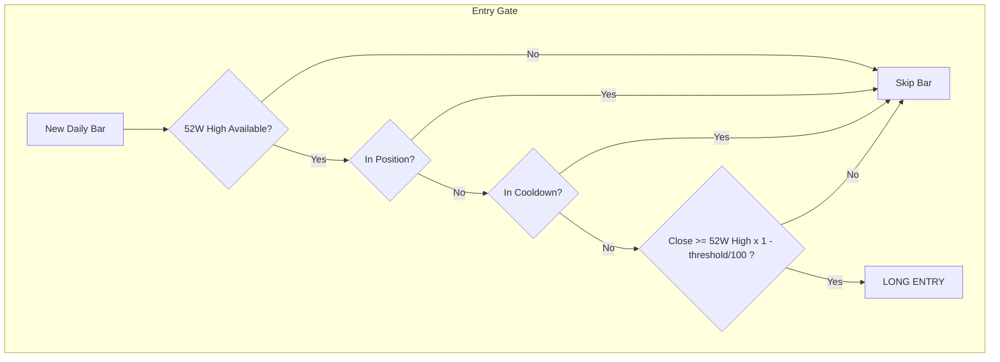
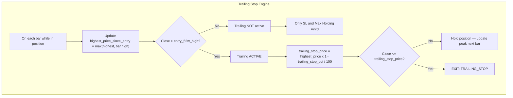
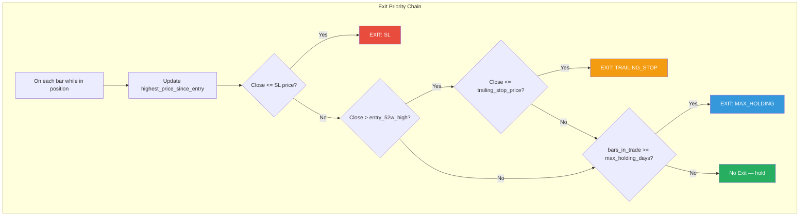
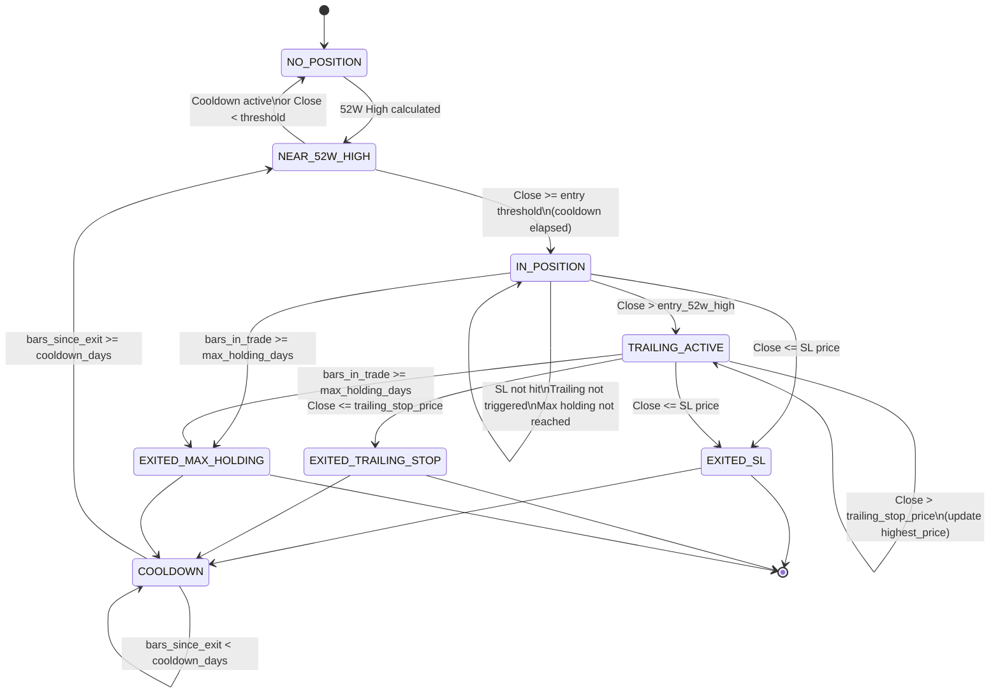
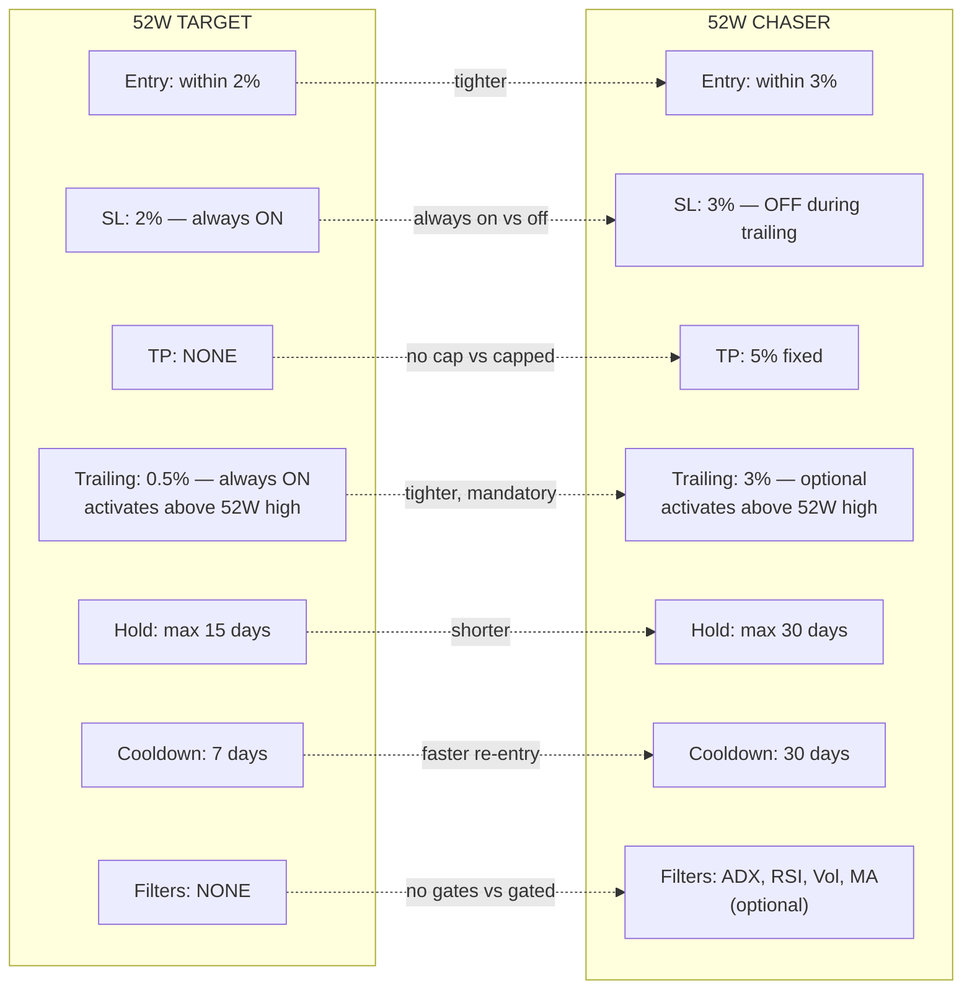
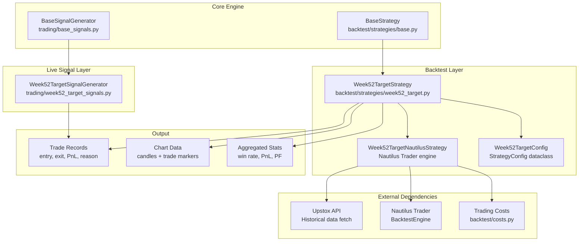

# 52-Week Target Swing Strategy

## Overview

The **52W Target** (`52W_TARGET`) is an aggressive swing trading strategy that enters long positions when price trades within a tight band below its rolling 52-week high. Once price breaks above the entry-time 52W high snapshot, a trailing stop activates to ride momentum. There is no fixed take-profit — the strategy relies entirely on the trailing stop to capture upside.

**Philosophy:** Stocks near 52-week highs tend to continue trending. Enter tight, trail fast, cut losers quickly.

- **Direction:** Long only
- **Timeframe:** Daily (swing)
- **SL Behavior:** Always active — even after trailing stop activates
- **TP:** None (effectively disabled at 0%)
- **Default Holding:** Up to 15 days

---

## Strategy Type

| Attribute       | Value          |
|-----------------|----------------|
| Direction       | Long only      |
| Timeframe       | Daily (swing)  |
| Order Type      | Market         |
| Position Sizing | Fixed shares   |

---

## Key Difference from 52W Chaser

The 52W Target is a more aggressive, tightly-wound variant of the 52W Chaser. Below is a feature-by-feature comparison:

| Feature                  | 52W Target                              | 52W Chaser                                  |
|--------------------------|-----------------------------------------|---------------------------------------------|
| **Entry Threshold**      | 2% below 52W high                       | 3% below 52W high                           |
| **Stop Loss**            | 2% (always active)                      | 3% (disabled once trailing activates)       |
| **Take Profit**          | None (`tp_pct = 0`, effectively 10x)    | 5% fixed                                    |
| **Trailing Stop**        | Always enabled, 0.5%                    | Optional, 3% (opt-in)                       |
| **Trailing Activation**  | Price > entry 52W high snapshot         | Price >= entry 52W high (when enabled)      |
| **Max Holding**          | 15 days                                 | 30 days                                     |
| **Cooldown**             | 7 days                                  | 30 days                                     |
| **Filters**              | None                                    | ADX, RSI, Volume, MA50, MA200 (optional)    |
| **Momentum Fade Exit**   | No                                      | Yes (NEW_52W_HIGH when 52W high rises 10%)  |
| **SL during trailing**   | Active                                  | Disabled                                    |

---

## Parameters

| Parameter              | Key                    | Default | Range         | Description                                                       |
|------------------------|------------------------|---------|---------------|-------------------------------------------------------------------|
| Entry Threshold        | `entry_threshold_pct`  | 2.0     | 1.0 – 10.0    | Max % below 52W high at which entry triggers                       |
| Stop Loss              | `sl_pct`               | 2.0     | 1.0 – 5.0     | Stop loss % from entry price — always active                       |
| Take Profit            | `tp_pct`               | 0.0     | 0             | Disabled; set to 0 with a far nominal value (10x price)           |
| Trailing Stop          | `trailing_stop_pct`    | 0.5     | 0.1 – 2.0     | Trailing stop % below highest price since entry                    |
| Max Holding Days       | `max_holding_days`     | 15      | 5 – 30        | Force exit after N bars in position                               |
| Cooldown Days          | `cooldown_days`        | 7       | 1 – 15        | Bars to wait after exit before re-entering                         |
| Trade Size             | `trade_size`           | 100     | 10 – 1000     | Number of shares per trade                                         |

---

## Entry Conditions



**Conditions:**

1. A rolling 52-week high has been calculated (>= 100 bars of history)
2. No open position exists
3. Cooldown period has elapsed since last exit
4. **Close price >= `52W high * (1 - entry_threshold_pct / 100)`**
5. No additional filters (volume, ADX, RSI, etc.)

**At entry, the strategy captures:**
- `entry_price` — the closing price of the entry bar
- `entry_52w_high` — the 52W high at the moment of entry (frozen snapshot)
- `highest_price_since_entry` — initialized to entry price

---

## Exit Conditions

Three mutually exclusive exit paths are checked on every bar while in position:

| Exit Type        | Trigger                                                    | Priority |
|------------------|------------------------------------------------------------|----------|
| **Stop Loss**    | Close <= `entry_price * (1 - sl_pct / 100)`               | 1st      |
| **Trailing Stop**| Close <= `highest_price * (1 - trailing_stop_pct / 100)`   | 2nd      |
| **Max Holding**  | Bars in position >= `max_holding_days`                     | 3rd      |

**Critical:** The stop loss is checked **first** and remains active **at all times**, even after the trailing stop has activated. This means if price reverses sharply, the SL will trigger before the trailing stop check is reached.

---

## Trailing Stop Mechanics



**Key behaviors:**
- The trailing stop only evaluates when `close > entry_52w_high` (the frozen 52W high snapshot from entry)
- `highest_price_since_entry` is updated every bar using the bar's high (not just when trailing is active)
- The trailing stop level is calculated as `highest_price_since_entry * (1 - trailing_stop_pct / 100)`
- At 0.5% default, the trailing stop is very tight — designed to lock in gains from a breakout above the 52W high

---

## Exit Priority Diagram



**Priority order is critical:**

1. **SL first** — Hard stop from entry price, always checked regardless of trailing state
2. **Trailing Stop second** — Only checked if SL didn't trigger AND price is above the entry 52W high
3. **Max Holding third** — Time-based exit, lowest priority

---

## State Diagram



---

## Comparison with 52W Chaser



---

## Risk Management

### Stop Loss Is Always Active

Unlike the 52W Chaser, which disables the fixed stop loss once the trailing stop activates, the 52W Target keeps the SL active at all times. This means:

- **Maximum risk per trade is capped** at `sl_pct` (default 2%) from entry, regardless of how high the price has gone
- If price breaks above the 52W high, rallies, then reverses sharply back below entry, the SL fires before the trailing stop check
- The SL check runs **before** the trailing stop check in the exit priority chain

### Tight Trailing Stop Risk/Reward

The 0.5% default trailing stop is deliberately tight:

- **Pros:** Locks in gains quickly after a breakout, prevents giving back profits during false breakouts
- **Cons:** Can be stopped out by normal intrabar volatility; may exit too early on strong trends
- **Net effect:** Higher win rate on trailing exits, but smaller average win per trade — compensated by higher trade frequency (shorter cooldown)

### Asymmetric Risk Profile

```
Risk (SL):         -2.0%  (hard floor)
Reward (trailing):  0.5%+  (uncapped — rides breakout as long as momentum holds)
Max Holding:        15 days (time stop prevents capital rot)
```

The strategy accepts many small trailing-stop exits to catch the occasional large breakout run. The 7-day cooldown ensures rapid re-deployment of capital.

---

## Architecture



### Module Responsibilities

| Module | Path | Responsibility |
|--------|------|----------------|
| `Week52TargetSignalGenerator` | `trading/week52_target_signals.py` | Live signal generation: `check_entry()` and `check_exit()` |
| `Week52TargetStrategy` | `backtest/strategies/week52_target.py` | API wrapper: param validation, parallel backtest orchestration, result aggregation |
| `Week52TargetNautilusStrategy` | `backtest/strategies/week52_target.py` | Core strategy logic: `on_bar()` entry/exit, state management, trade tracking |
| `Week52TargetConfig` | `backtest/strategies/week52_target.py` | Nautilus `StrategyConfig` dataclass with all parameters |
| `BaseStrategy` | `backtest/strategies/base.py` | Abstract base for all strategies; defines `StrategyParam` |
| `BaseSignalGenerator` | `trading/base_signals.py` | Abstract base for live signal generators |

---

## Implementation Notes

### Entry 52W High Snapshot

At entry time, `entry_52w_high` is frozen to the current rolling 52-week high. This snapshot is critical — the trailing stop uses this frozen value as its activation threshold, not the live 52W high. If the market makes a new 52W high after entry, the activation threshold remains at the entry-time level.

### Cooldown Initialization

The strategy initializes `bars_since_exit` to `cooldown_bars` so that it can enter immediately on the first qualifying bar (no startup cooldown).

### 52W High Calculation

- Rolling window of **252 trading days** (approximately 1 calendar year)
- Falls back to using all available history if between 100–252 bars
- Requires minimum **100 bars** before any entry is considered
- Uses **bar high** (not close) for 52W high calculation

### Trading Costs

All PnL calculations include trading costs computed via `backtest/costs.py`. Net PnL is reported after deducting brokerage, STT, transaction charges, and GST.
