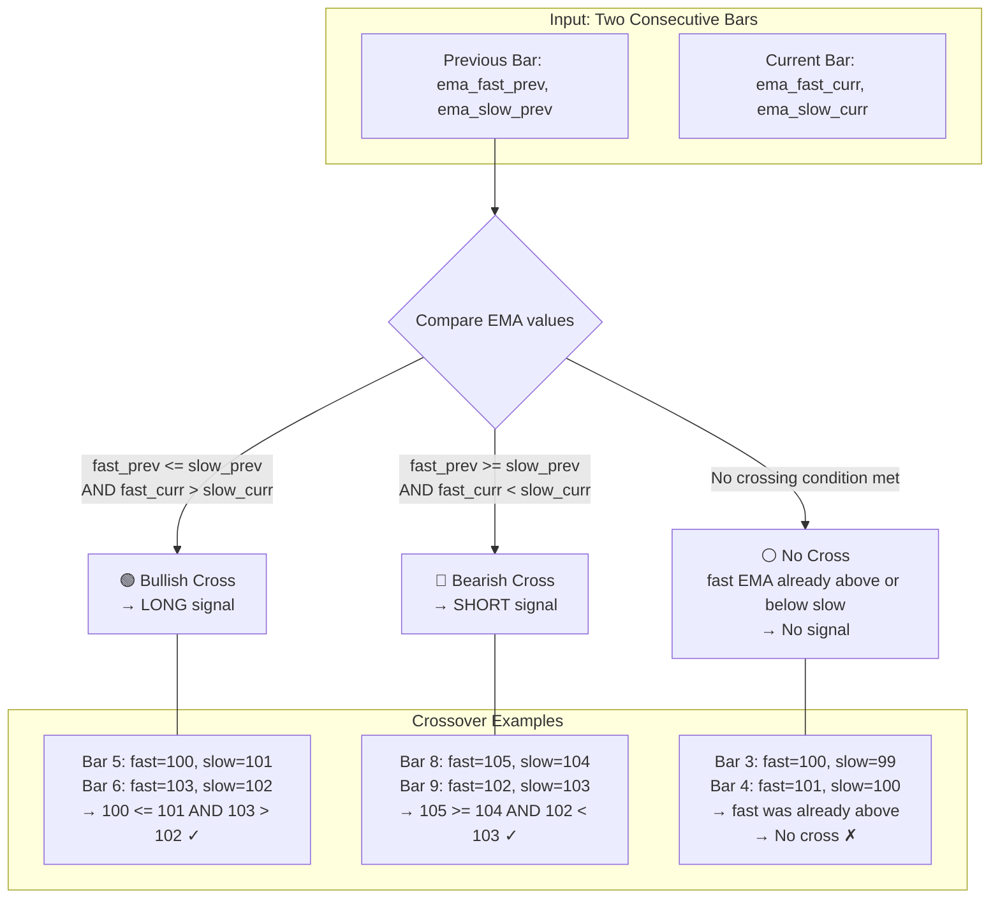
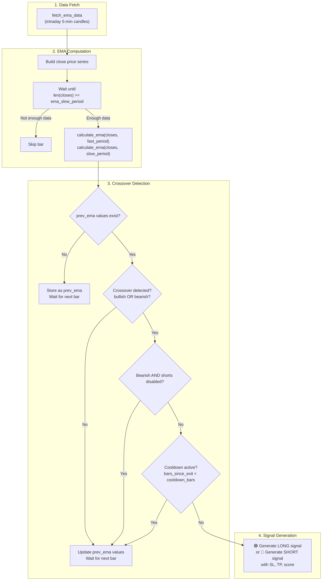
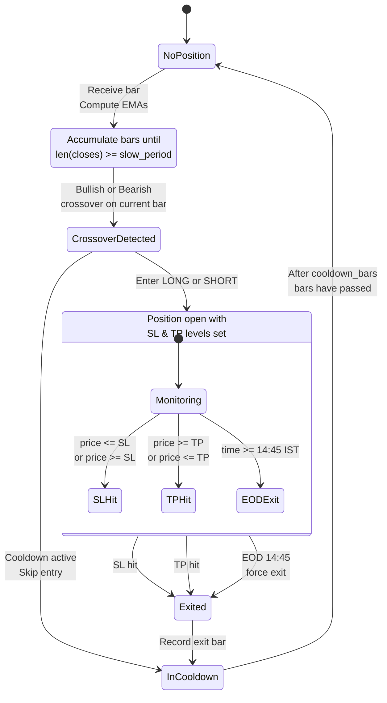
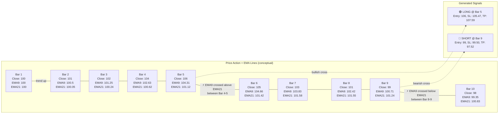
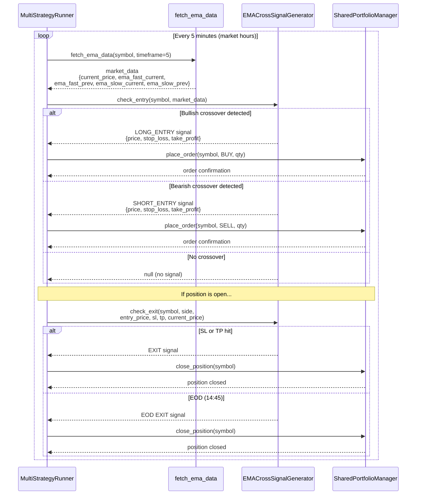
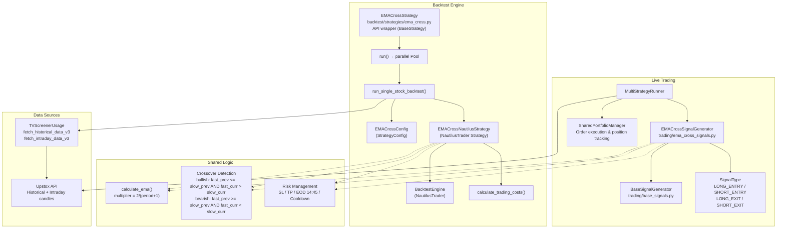

# EMA Crossover Strategy

Intraday momentum strategy that generates long and short signals based on exponential moving average crossovers. Designed for 5-minute candle data on equity markets (NSE). The strategy enters when a fast EMA crosses above/below a slow EMA and manages positions with fixed stop-loss, take-profit, and end-of-day force exit.

**Strategy Type:** Intraday (5-min candles)
**Strategy ID:** `EMA_CROSS`
**Source:** `trading/ema_cross_signals.py`, `backtest/strategies/ema_cross.py`

---

## Parameters

| Parameter | Key | Default | Range | Description |
|-----------|-----|---------|-------|-------------|
| Fast EMA Period | `ema_fast_period` | `9` | 3–50 | Lookback period for the fast (responsive) EMA |
| Slow EMA Period | `ema_slow_period` | `21` | 10–200 | Lookback period for the slow (lagging) EMA |
| Stop Loss % | `sl_pct` | `0.5` | 0.1–3.0 | Percentage below/above entry for stop-loss |
| Take Profit % | `tp_pct` | `1.5` | 0.3–5.0 | Percentage above/below entry for take-profit |
| Candle Timeframe | `timeframe` | `5` | 1–60 | Candle interval in minutes |
| Trade Size | `trade_size` | `100` | 1–10000 | Number of shares per order |
| Enable Shorts | `enable_shorts` | `false` | bool | Allow short (SELL) entries on bearish crosses |
| Cooldown Bars | `cooldown_bars` | `3` | 1–20 | Number of bars to wait after exit before re-entry |
| Include Costs | `include_costs` | `true` | bool | Deduct brokerage/stamp duty/charges from P&L |

**Validation rules:**
- `ema_fast_period` must be strictly less than `ema_slow_period`
- `sl_pct` must be less than `tp_pct`
- All ranges enforced in `EMACrossStrategy.validate_params()`

---

## EMA Calculation

The Exponential Moving Average applies more weight to recent prices, making it more responsive than a simple moving average.

### Formula

```
multiplier = 2 / (period + 1)

EMA_0 = closes[0]                        # first value seeded with first close
EMA_t = close_t * multiplier + EMA_{t-1} * (1 - multiplier)
```

### Worked Example: 3-Period EMA

Given closes: `[100, 102, 105, 103, 108]`

```
multiplier = 2 / (3 + 1) = 0.5

EMA_0 = 100.00
EMA_1 = 102 * 0.5 + 100 * 0.5 = 51.0 + 50.0 = 101.00
EMA_2 = 105 * 0.5 + 101 * 0.5 = 52.5 + 50.5 = 103.00
EMA_3 = 103 * 0.5 + 103 * 0.5 = 51.5 + 51.5 = 103.00
EMA_4 = 108 * 0.5 + 103 * 0.5 = 54.0 + 51.5 = 105.50
```

The EMA reacts faster to the jump at close[4] (108) than an SMA would, because the multiplier weights the latest price at 50%.

---

## Entry Conditions

### Bullish (LONG)

```
fast_ema_prev  <=  slow_ema_prev
fast_ema_curr  >   slow_ema_curr
```

The fast EMA was at or below the slow EMA on the previous bar, and has moved above it on the current bar.

### Bearish (SHORT) — only when `enable_shorts = true`

```
fast_ema_prev  >=  slow_ema_prev
fast_ema_curr  <   slow_ema_curr
```

The fast EMA was at or above the slow EMA on the previous bar, and has dropped below it on the current bar.

### No Signal

When the fast EMA is already above the slow EMA (no new cross) or already below — no signal is generated. The strategy only fires on the **crossover bar itself**.

---

## Exit Conditions

| Exit Type | LONG Position | SHORT Position | Notes |
|-----------|---------------|----------------|-------|
| Stop Loss | `price <= entry * (1 - sl_pct/100)` | `price >= entry * (1 + sl_pct/100)` | Checked every bar |
| Take Profit | `price >= entry * (1 + tp_pct/100)` | `price <= entry * (1 - tp_pct/100)` | Checked every bar |
| EOD Force Exit | Always | Always | At 14:45 IST, all open positions are closed at market price |

### SL/TP Calculation Example

Entry at 1000 with `sl_pct=0.5`, `tp_pct=1.5`:

| Side | Stop Loss | Take Profit |
|------|-----------|-------------|
| LONG | 1000 * 0.995 = **995.00** | 1000 * 1.015 = **1015.00** |
| SHORT | 1000 * 1.005 = **1005.00** | 1000 * 0.985 = **985.00** |

---

## Crossover Detection



---

## Signal Generation Flow



---

## State Diagram



---

## Visual Example — Price Chart with EMA Crossovers



---

## Timing Diagram — Component Interaction



---

## Risk Management

### Stop Loss

- **LONG:** `entry_price * (1 - sl_pct/100)` — triggers when price falls by `sl_pct`%
- **SHORT:** `entry_price * (1 + sl_pct/100)` — triggers when price rises by `sl_pct`%
- Checked on every bar's close price

### Take Profit

- **LONG:** `entry_price * (1 + tp_pct/100)` — triggers when price rises by `tp_pct`%
- **SHORT:** `entry_price * (1 - tp_pct/100)` — triggers when price falls by `tp_pct`%
- Checked on every bar's close price

### Risk-Reward Ratio

With defaults (`sl_pct=0.5`, `tp_pct=1.5`):

```
Risk : Reward = 0.5 : 1.5 = 1 : 3
```

### Cooldown After Exit

After any exit (SL, TP, or EOD), the strategy waits `cooldown_bars` (default: 3) consecutive bars before entering a new position. This prevents churning in volatile, sideways markets where EMA crossovers may fire repeatedly.

```
bars_since_exit = current_bar_number - last_exit_bar_number
if bars_since_exit < cooldown_bars:
    skip entry
```

### EOD Force Exit

All open positions are forcibly closed at **14:45 IST** to avoid overnight exposure. This is checked in both the live signal generator (`EMACrossSignalGenerator.check_exit`) and the backtest engine (`EMACrossNautilusStrategy.on_bar`).

### Trading Costs

When `include_costs=true`, the backtest deducts brokerage, STT, exchange charges, stamp duty, and GST via `calculate_trading_costs(entry_price, exit_price, quantity)`. Net P&L is:

```
net_pnl = gross_pnl - total_trading_costs
```

---

## Architecture



---

## Key Files

| File | Purpose |
|------|---------|
| `trading/ema_cross_signals.py` | Live signal generator — `EMACrossSignalGenerator` with `check_entry()` and `check_exit()` |
| `trading/base_signals.py` | Base class `BaseSignalGenerator` providing `create_signal()` and SL/TP defaults |
| `trading/orb_signals.py` | Shared `SignalType` enum and `ORBSignal` model |
| `backtest/strategies/ema_cross.py` | Backtest strategy — `EMACrossNautilusStrategy` (NautilusTrader), `EMACrossStrategy` (API wrapper), `EMACrossConfig` |
| `backtest/strategies/base.py` | `BaseStrategy` and `StrategyParam` definitions |
| `backtest/costs.py` | `calculate_trading_costs()` for brokerage and charges |
