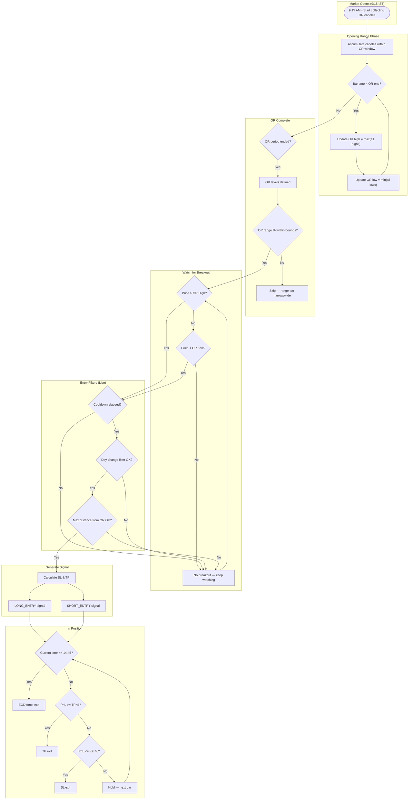
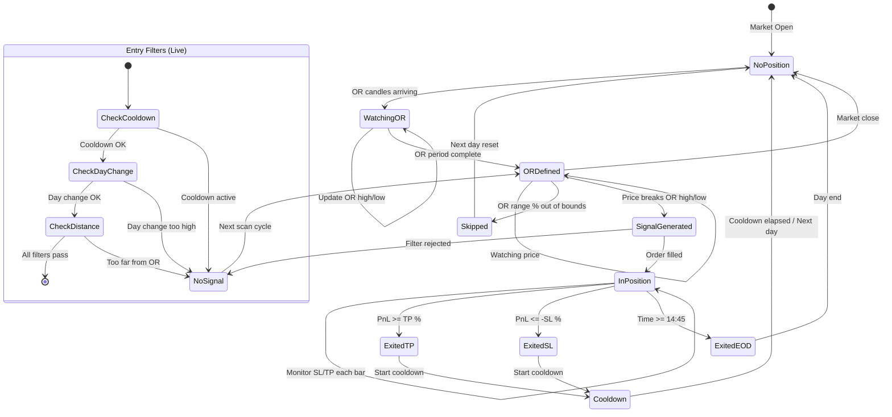
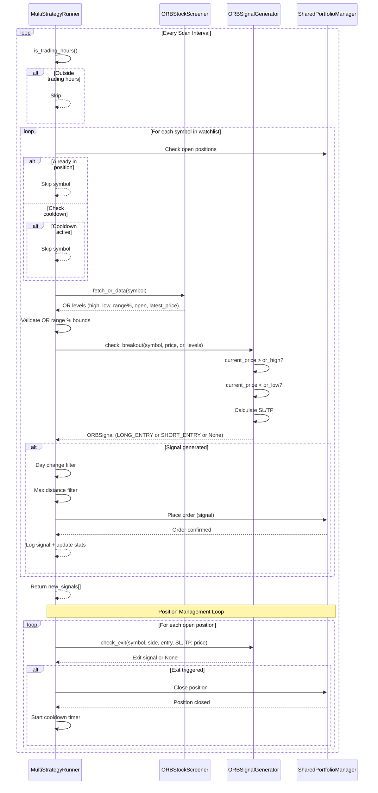

# ORB - Opening Range Breakout Strategy

## Overview

ORB (Opening Range Breakout) is an intraday strategy that identifies the high and low of the first N minutes after market open (the "opening range"), then enters a position when price breaks out above or below that range. The strategy uses fixed percentage-based stop loss and take profit, with an end-of-day force exit to ensure no overnight exposure.

## Strategy Type

- **Type**: Intraday
- **Time-bound**: Yes — all positions are closed before market close
- **Directional**: Long by default, optional short
- **Market**: Indian equities (NSE), 5-minute timeframe
- **Entry window**: After OR period completes (e.g., after 10:00 AM IST) until 14:45 IST
- **Force exit**: 14:45 IST — all open positions closed

## Parameters

| Parameter | Key | Default | Range | Description |
|---|---|---|---|---|
| OR Period | `or_minutes` | 45 | 15–120 | Duration (minutes) of the opening range starting at 9:15 IST |
| Timeframe | `timeframe` | 5 | 1, 5, 15 | Candle interval in minutes for data and bar processing |
| Stop Loss % | `stop_loss_pct` / `sl_pct` | 0.4 | 0.1–2.0 | Fixed percentage SL from entry price |
| Take Profit % | `take_profit_pct` / `tp_pct` | 1.2 | 0.2–4.0 | Fixed percentage TP from entry price |
| Trade Size | `trade_size` | 100 | 1–5000 | Number of shares per trade |
| Min OR Range % | `min_or_range_pct` | 0.5 | — | Minimum opening range as % of price to generate signals |
| Max OR Range % | `max_or_range_pct` | 3.0 | — | Maximum opening range as % of price to generate signals |
| Cooldown Bars | `cooldown_bars` / `cooldown_minutes` | 3 | 0–20 | Bars (backtest) or minutes (live) to wait after exit before re-entry |
| Max Distance from OR % | `max_distance_from_or_pct` | 1.5 | — | Live-only filter: skip if price moved too far from OR level |
| Enable Shorts | `enable_shorts` | false | — | Allow short (SELL) entries on breakdown below OR low |

**Validation rules**:
- OR period must be at least 15 minutes
- Stop loss must be less than take profit
- Timeframe must be one of: 1, 5, 15

## Entry Conditions

### Long Entry

- Price closes **above OR high** after the OR period has completed
- OR range % must be within `[min_or_range_pct, max_or_range_pct]`
- Cooldown period must have elapsed since last exit
- Day change filter (live): day change from open must be <= 2.0%
- Price distance from OR (live): within `max_distance_from_or_pct`

```
Long SL  = entry_price * (1 - sl_pct / 100)
Long TP  = entry_price * (1 + tp_pct / 100)
```

### Short Entry (when enabled)

- Price closes **below OR low** after the OR period has completed
- OR range % must be within `[min_or_range_pct, max_or_range_pct]`
- Cooldown period must have elapsed since last exit
- Day change filter (live): day change from open must be <= 1.0% (avoids shorting in uptrend)

```
Short SL = entry_price * (1 + sl_pct / 100)
Short TP = entry_price * (1 - tp_pct / 100)
```

## Exit Conditions

| Condition | Description | Priority |
|---|---|---|
| **Take Profit** | PnL % >= `tp_pct` | 1 (checked first) |
| **Stop Loss** | PnL % <= `-sl_pct` | 2 |
| **EOD Force Exit** | Time >= 14:45 IST | 3 (non-negotiable) |

All exits are market orders. After exit, the cooldown timer starts before the same symbol can generate another signal.

## Flow Diagram



## State Diagram



## Timing Diagram



## Risk Management

### Stop Loss & Take Profit

SL and TP are calculated as fixed percentages from entry price at the time of signal generation:

```
Long:
  SL = entry_price × (1 - sl_pct / 100)
  TP = entry_price × (1 + tp_pct / 100)

Short:
  SL = entry_price × (1 + sl_pct / 100)
  TP = entry_price × (1 - tp_pct / 100)
```

Default risk-reward ratio: `0.4% SL` / `1.2% TP` = **1:3 R:R**

### Max Distance from OR

Live-only filter (`max_distance_from_or_pct`, default 1.5%). If price has already moved too far from the OR breakout level by the time the scan runs, the signal is skipped to avoid chasing.

### Day Change Filters

Applied only in live trading to filter out unfavorable market conditions:

| Side | Condition | Threshold | Rationale |
|---|---|---|---|
| LONG | Day change % | > 2.0% | Stock already up significantly — risk of reversal |
| SHORT | Day change % | > 1.0% | Stock in uptrend — counter-trend short avoided |

```
day_change_pct = ((current_price - day_open) / day_open) × 100
```

### Cooldown Period

After any exit (SL, TP, or EOD), the strategy waits before generating a new signal for the same symbol:

- **Backtest**: `cooldown_bars` (default 3 bars) — number of candle bars to skip
- **Live**: `cooldown_minutes` (default 30 minutes) — wall-clock minutes to wait

### EOD Force Exit

All positions are force-closed at 14:45 IST (45 minutes before 15:30 market close) to eliminate overnight risk and closing volatility.

## Architecture

```mermaid
graph TD
    subgraph Frontend["Frontend (React)"]
        UI["Backtest UI\nStrategy Config"]
    end

    subgraph API["API Layer (FastAPI)"]
        BT["Backtest API\n/orb/run"]
        PT["Paper Trading API\n/orb/signals"]
    end

    subgraph Backtest["Backtest Engine"]
        ORBS["ORBStrategy\n(API wrapper)"]
        ORBN["ORBNautilusStrategy\n(Nautilus Trader)"]
        ORBC["ORBConfig"]
        PU["Parallel Worker Pool"]
    end

    subgraph LiveTrading["Live Trading"]
        MSR["MultiStrategyRunner"]
        OBB["ORBStockScreener"]
        SPM["SharedPortfolioManager"]
    end

    subgraph SignalGen["Signal Generation"]
        OSG["ORBSignalGenerator"]
        OS["ORBSignal\ndataclass"]
    end

    subgraph Data["Data Sources"]
        UP["Upstox API\n(Historical + Live)"]
        DB["SQLite / PostgreSQL"]
    end

    UI --> BT
    UI --> PT

    BT --> ORBS
    ORBS --> PU
    PU --> ORBN
    ORBC --> ORBN

    PT --> MSR
    MSR --> OBB
    MSR --> OSG
    MSR --> SPM

    OSG --> OS
    OBB --> UP
    ORBN --> UP
    SPM --> DB
    OSG --> DB

    UP -->|Historical data| ORBN
    UP -->|5-min candles| OBB
```



### Component Responsibilities

| Component | File | Role |
|---|---|---|
| `ORBStrategy` | `backtest/strategies/orb.py` | API-facing wrapper; defines params, validation, runs parallel backtests |
| `ORBNautilusStrategy` | `backtest/strategies/orb.py` | Nautilus Trader strategy; processes bars, manages OR levels, entries, exits |
| `ORBConfig` | `backtest/strategies/orb.py` | Pydantic config for Nautilus strategy (instrument, bar type, SL/TP, etc.) |
| `ORBSignalGenerator` | `trading/orb_signals.py` | Live signal generation; calculates OR levels from candles, checks breakouts, manages exits |
| `ORBStockScreener` | (via MultiStrategyRunner) | Fetches OR data (high, low, range%) for live symbols |
| `MultiStrategyRunner` | `trading/multi_strategy_runner.py` | Orchestrates live scanning loop; applies filters, delegates to signal generators, manages portfolio |
| `SharedPortfolioManager` | `trading/` | Tracks open positions, executes orders, manages cooldown timers |
| `create_entry_signal` | `trading/orb_signals.py` | Convenience function to manually construct an ORB signal |
