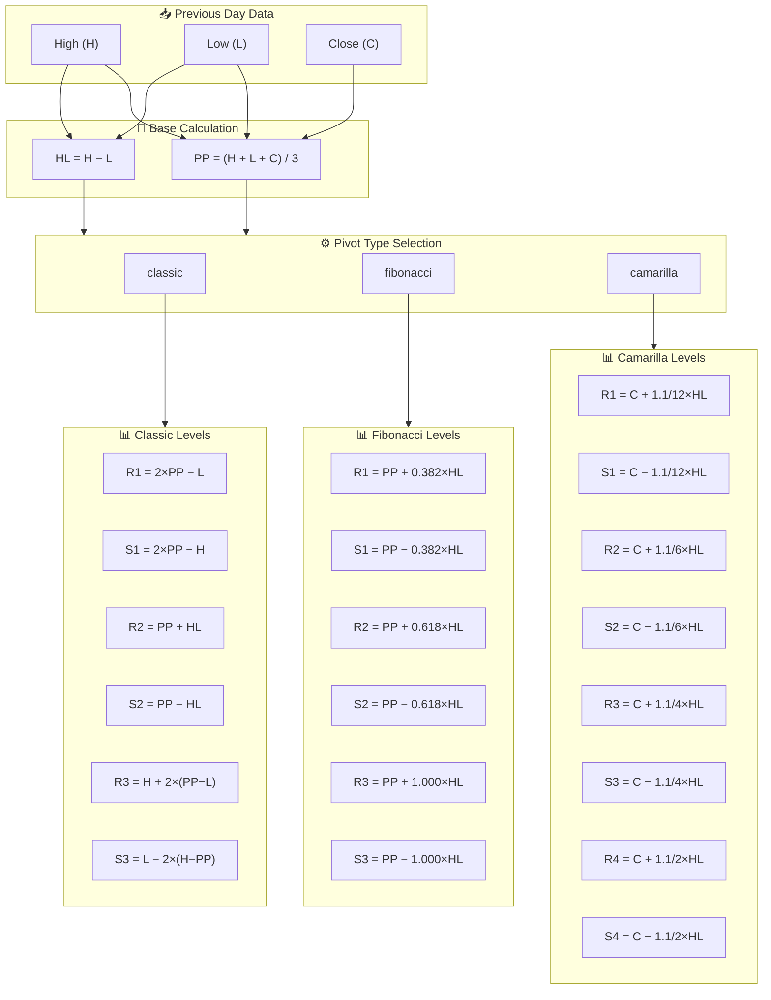
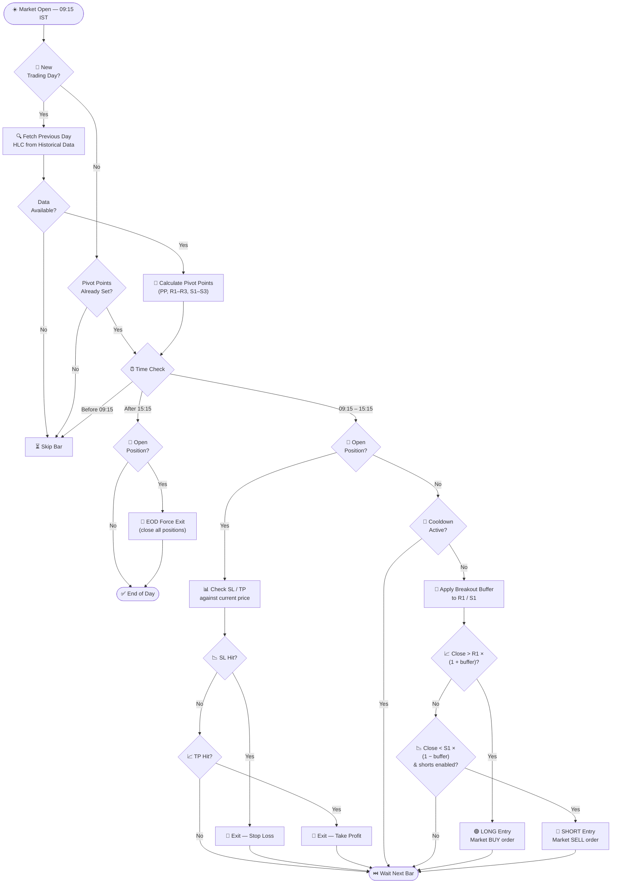
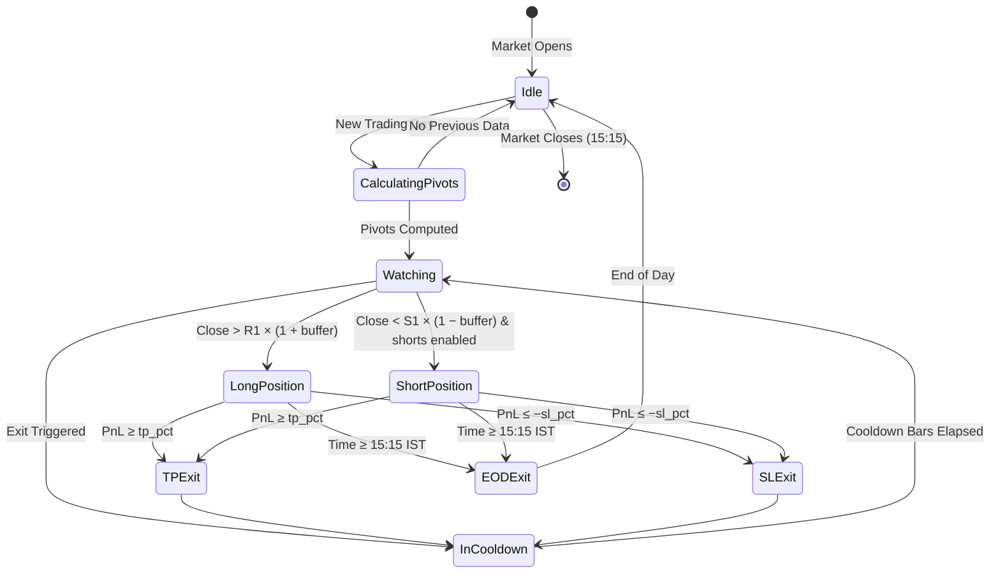
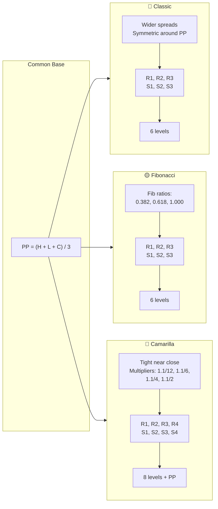
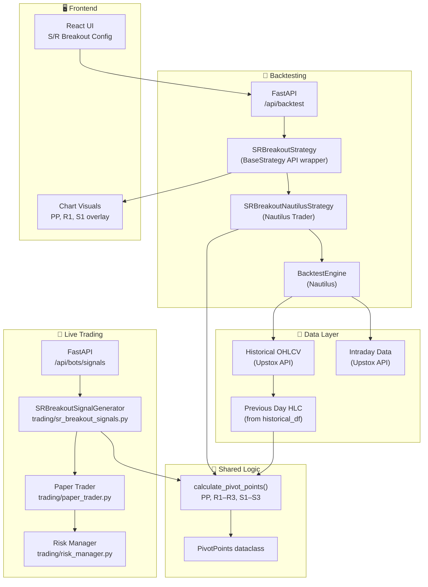

# S/R Breakout — Support/Resistance Breakout Strategy

An intraday strategy that computes pivot points (PP, R1–R3, S1–S3) from the **previous day's High, Low, Close** and enters trades when price breaks through the first resistance (R1) or support (S1) level, filtered by a configurable breakout buffer to reduce false signals.

**Strategy ID:** `SR_BREAKOUT`
**Source:** `trading/sr_breakout_signals.py`, `backtest/strategies/sr_breakout.py`

---

## Strategy Type

| Attribute         | Value          |
|-------------------|----------------|
| Time horizon      | **Intraday**   |
| Markets           | Equity (NSE)   |
| Timeframes        | 1 min, 5 min, 15 min |
| Direction         | Long & Short (shorts optional) |
| Session           | 09:15 – 15:15 IST |

---

## Parameters

| Parameter | Key | Default | Range | Description |
|-----------|-----|---------|-------|-------------|
| Pivot Type | `pivot_type` | `classic` | `classic`, `fibonacci`, `camarilla` | Formula used to compute PP, R1–R3, S1–S3 |
| Breakout Buffer % | `breakout_buffer_pct` | `0.1` | 0.0 – 0.5 (step 0.05) | Buffer above R1 / below S1 required to confirm breakout |
| Stop Loss % | `sl_pct` / `stop_loss_pct` | `0.5` | 0.1 – 2.0 (step 0.1) | Fixed percentage stop-loss from entry price |
| Take Profit % | `tp_pct` / `take_profit_pct` | `1.5` | 0.2 – 4.0 (step 0.1) | Fixed percentage take-profit from entry price |
| Trade Size | `trade_size` | `100` | 1 – 5000 | Number of shares per order |
| Timeframe | `timeframe` | `5` | 1, 5, 15 | Bar interval in minutes |
| Cooldown Bars | `cooldown_bars` | `3` | 0 – 20 | Minimum bars to wait after exit before re-entry |
| Enable Shorts | `enable_shorts` | `false` | true / false | Allow short (SELL) entries on S1 breakdown |

**Validation rules:**
- `sl_pct` must be less than `tp_pct`
- `pivot_type` must be one of `classic`, `fibonacci`, `camarilla`
- `timeframe` must be one of `1`, `5`, `15`

---

## Pivot Point Formulas

All three types share the same base **Pivot Point**:

$$PP = \frac{H + L + C}{3}$$

Where **H** = previous day's High, **L** = previous day's Low, **C** = previous day's Close.

### Classic

| Level | Formula |
|-------|---------|
| PP | (H + L + C) / 3 |
| R1 | 2 × PP − L |
| R2 | PP + (H − L) |
| R3 | H + 2 × (PP − L) |
| S1 | 2 × PP − H |
| S2 | PP − (H − L) |
| S3 | L − 2 × (H − PP) |

### Fibonacci

| Level | Formula |
|-------|---------|
| PP | (H + L + C) / 3 |
| R1 | PP + 0.382 × (H − L) |
| R2 | PP + 0.618 × (H − L) |
| R3 | PP + 1.000 × (H − L) |
| S1 | PP − 0.382 × (H − L) |
| S2 | PP − 0.618 × (H − L) |
| S3 | PP − 1.000 × (H − L) |

### Camarilla

| Level | Formula |
|-------|---------|
| PP | (H + L + C) / 3 |
| R1 | C + 1.1/12 × (H − L) |
| R2 | C + 1.1/6 × (H − L) |
| R3 | C + 1.1/4 × (H − L) |
| R4 | C + 1.1/2 × (H − L) |
| S1 | C − 1.1/12 × (H − L) |
| S2 | C − 1.1/6 × (H − L) |
| S3 | C − 1.1/4 × (H − L) |
| S4 | C − 1.1/2 × (H − L) |

> **Note:** The Camarilla variant produces 8 levels (R1–R4, S1–S4) plus PP. The signal generator includes R4 and S4 in its output dict when `pivot_type == "camarilla"`.

---

## Entry Conditions

### Long Entry (BUY)

```
close > R1 × (1 + breakout_buffer_pct / 100)
```

- Triggers when the current bar's close exceeds R1 **plus** the breakout buffer.
- Example with R1 = 500, buffer = 0.1%: entry fires when close > 500.50.

### Short Entry (SELL) — optional

```
close < S1 × (1 - breakout_buffer_pct / 100)
```

- Only fires when `enable_shorts` is `true`.
- Triggers when the current bar's close falls below S1 **minus** the breakout buffer.
- Example with S1 = 490, buffer = 0.1%: entry fires when close < 489.51.

### Cooldown

After an exit, the strategy waits `cooldown_bars` (default 3) bars before evaluating a new entry, preventing rapid re-entry on the same move.

---

## Exit Conditions

| Exit Type | Condition | Priority |
|-----------|-----------|----------|
| **Stop Loss** | PnL % ≤ −sl_pct | 1 (checked first) |
| **Take Profit** | PnL % ≥ tp_pct | 2 |
| **EOD Force Exit** | Time ≥ 15:15 IST | 3 (overrides everything) |

### SL/TP Calculation (Live Signals)

| Side | Stop Loss | Take Profit |
|------|-----------|-------------|
| LONG | entry × (1 − sl_pct / 100) | entry × (1 + tp_pct / 100) |
| SHORT | entry × (1 + sl_pct / 100) | entry × (1 − tp_pct / 100) |

### SL/TP Calculation (Backtest — PnL-based)

The backtest engine tracks percentage PnL from entry and exits when:

```
LONG:  pnl_pct = ((close - entry_price) / entry_price) × 100
SHORT: pnl_pct = ((entry_price - close) / entry_price) × 100

Exit TP when pnl_pct >= tp_pct
Exit SL when pnl_pct <= -sl_pct
```

---

## Pivot Point Calculation Diagram



---

## Signal Generation Flow



---

## Position Lifecycle State Diagram



---

## Pivot Type Comparison



| Characteristic | Classic | Fibonacci | Camarilla |
|----------------|---------|-----------|-----------|
| Anchor | PP | PP | Close |
| Level count | 6 (R1–R3, S1–S3) | 6 (R1–R3, S1–S3) | 8 (R1–R4, S1–S4) |
| Spacing | Moderate, symmetric | Based on Fib ratios | Tight, clustered near close |
| Best for | General breakout trading | Trend continuation | Range-bound / mean-reversion |
| Sensitivity | Medium | Medium | Higher (more levels, tighter) |

---

## Risk Management

### Breakout Buffer — False Breakout Filter

The `breakout_buffer_pct` parameter is the primary defense against **false breakouts** (price briefly piercing R1/S1 then reversing). Rather than entering immediately on touch, the strategy requires price to close **beyond** the level by a margin:

- **Long:** `close > R1 × (1 + buffer/100)` — price must sustain above R1
- **Short:** `close < S1 × (1 - buffer/100)` — price must sustain below S1

| Buffer | Effect |
|--------|--------|
| 0.0% | No filter — highest signal count, most false breakouts |
| 0.1% (default) | Light filter — removes marginal breakouts |
| 0.3% | Moderate filter — fewer but higher-quality signals |
| 0.5% | Aggressive filter — very few trades, strong conviction required |

### Stop Loss / Take Profit

- Default SL: 0.5%, TP: 1.5% → **reward-to-risk ratio of 3:1**
- SL and TP are set at **entry time** as fixed percentages — they do not trail
- The backtest engine validates that `sl_pct < tp_pct` before running

### Cooldown Bars

After any exit, the strategy ignores entry signals for `cooldown_bars` consecutive bars. This prevents:

- Re-entering immediately after a stop-loss on the same level
- Chasing a breakout that immediately reverses
- Over-trading in volatile, choppy sessions

### EOD Force Exit

All positions are forcibly closed at **15:15 IST** (45 minutes before market close at 16:00 IST). This eliminates overnight gap risk and is enforced as the highest-priority exit check.

---

## Architecture



### Module Map

| Module | Class / Function | Role |
|--------|-----------------|------|
| `trading/sr_breakout_signals.py` | `SRBreakoutSignalGenerator` | Live signal generation (entry + exit) |
| `backtest/strategies/sr_breakout.py` | `calculate_pivot_points()` | Pure function — computes PP, R1–R3, S1–S3 |
| `backtest/strategies/sr_breakout.py` | `PivotPoints` | Dataclass holding all pivot levels |
| `backtest/strategies/sr_breakout.py` | `SRBreakoutNautilusStrategy` | Nautilus Trader strategy (on_bar logic) |
| `backtest/strategies/sr_breakout.py` | `SRBreakoutStrategy` | API-facing wrapper (BaseStrategy) |
| `backtest/strategies/sr_breakout.py` | `SRBreakoutConfig` | Nautilus StrategyConfig (dataclass) |
| `backtest/strategies/sr_breakout.py` | `run_single_stock_backtest()` | Standalone backtest runner per symbol |
| `trading/orb_signals.py` | `ORBSignal`, `SignalType` | Shared signal / signal-type models |
| `trading/base_signals.py` | `BaseSignalGenerator` | Base class for signal generators |
| `backtest/strategies/base.py` | `BaseStrategy`, `StrategyParam` | Base class + param definition |
| `backtest/costs.py` | `calculate_trading_costs()` | Brokerage + charges calculation |
