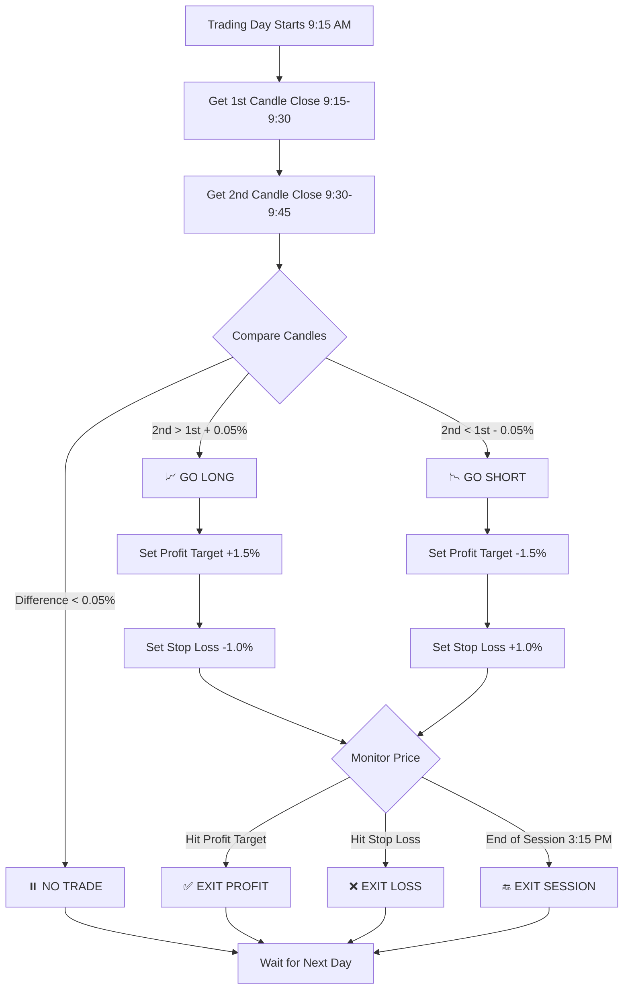
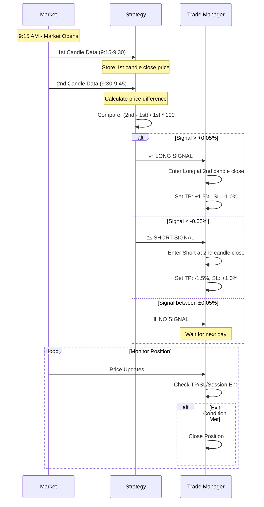

# 🕯️ Two-Candle Trading Strategy

## 📋 Overview

The Two-Candle Strategy is a simple yet effective intraday trading approach that makes trading decisions based on the comparison between the first two 15-minute candles of each trading day.

### Core Logic
- **LONG**: If 2nd candle closes above 1st candle by minimum threshold → Go Long
- **SHORT**: If 2nd candle closes below 1st candle by minimum threshold → Go Short

## 🔄 Strategy Flow



## 🧮 Signal Generation Process



## 📊 Trade Examples

### Example 1: Successful LONG Trade

```mermaid
gantt
    title LONG Trade Example - RELIANCE 2025-07-16
    dateFormat HH:mm
    axisFormat %H:%M
    
    section Candles
    1st Candle (₹1533.10)     :active, c1, 09:15, 09:30
    2nd Candle (₹1535.25)     :active, c2, 09:30, 09:45
    
    section Signal
    Calculate Diff (+0.14%)   :milestone, sig, 09:45, 09:45
    LONG Signal Generated     :crit, long, 09:45, 09:45
    
    section Trade
    Enter LONG ₹1535.25       :entry, 09:45, 09:50
    Monitor Position          :monitor, 09:50, 15:15
    Hit Profit Target ₹1558   :milestone, tp, 11:30, 11:30
```



**Trade Details:**
- 1st Candle: ₹1533.10
- 2nd Candle: ₹1535.25
- Signal Strength: +0.14%
- Entry: ₹1535.25 (LONG)
- Target: ₹1558.25 (+1.5%)
- Stop: ₹1519.95 (-1.0%)
- Result: ✅ Profit +₹23.00

### Example 2: Successful SHORT Trade

```mermaid
gantt
    title SHORT Trade Example - COCHINSHIP 2025-07-18
    dateFormat HH:mm
    axisFormat %H:%M
    
    section Candles
    1st Candle (₹1917.00)     :active, c1, 09:15, 09:30
    2nd Candle (₹1910.00)     :active, c2, 09:30, 09:45
    
    section Signal
    Calculate Diff (-0.37%)   :milestone, sig, 09:45, 09:45
    SHORT Signal Generated    :crit, short, 09:45, 09:45
    
    section Trade
    Enter SHORT ₹1910.00      :entry, 09:45, 09:50
    Monitor Position          :monitor, 09:50, 15:15
    Hit Profit Target ₹1881   :milestone, tp, 14:45, 14:45
```



**Trade Details:**
- 1st Candle: ₹1917.00
- 2nd Candle: ₹1910.00
- Signal Strength: -0.37%
- Entry: ₹1910.00 (SHORT)
- Target: ₹1881.35 (-1.5%)
- Stop: ₹1929.10 (+1.0%)
- Result: ✅ Profit +₹14.38

## 🎯 Strategy Parameters (Enhanced Version with Sentiment Analysis)

| Parameter | Value | Description |
|-----------|-------|-------------|
| **Timeframe** | 15 minutes | Candle interval |
| **Signal Threshold** | ±0.05% | Minimum price difference |
| **Profit Target** | 5.0% | Take profit level (increased for stocks) |
| **Stop Loss** | 2.0% | Maximum loss per trade (increased) |
| **Trailing Stop** | Enabled | 1.0% trailing distance (increased) |
| **Position Size** | 10% | Percentage of capital per trade |
| **Sentiment Filter** | Enabled | Stock trend-based signal adjustment |
| **Trading Hours** | 9:15 AM - 3:15 PM | Indian market hours |

## 📈 Performance Metrics

### Recent Backtests (Sentiment-Aware Strategy with Optimized Parameters)

#### COCHINSHIP (₹200K capital, 15% position, 5% target, 2% SL)
- **Total Trades**: 10
- **Win Rate**: 60% (6/10)
- **Total P&L**: +₹422 (+0.21%) - **DOUBLED from +₹217**
- **Best Trade**: +₹716 (SHORT session close, sentiment-amplified)
- **Position Value**: ₹30,000 per trade
- **Strategy**: Higher TP/SL + sentiment filtering significantly improved results

#### RELIANCE (₹100K capital, 15% position, 30 days, 5% target, 2% SL)
- **Total Trades**: 9 (SHORTS-only with sentiment filtering)
- **Win Rate**: 66.7% (6/9)
- **Total P&L**: +₹183 (+0.18%) - **PROFITABLE from -₹20**
- **Position Value**: ₹15,000 per trade
- **Strategy**: Sentiment analysis shows BUL/BEA/NEU trends effectively

#### Performance Improvements with New Parameters
| Metric | Old (3%/1%) | New (5%/2%) | Improvement |
|--------|-------------|-------------|-------------|
| **COCHINSHIP P&L** | +₹217 | **+₹422** | **+94%** |
| **RELIANCE P&L** | -₹20 | **+₹183** | **Profitable** |
| **Risk/Reward** | 3:1 | 2.5:1 | Better balance |

## 🔧 Implementation Details

### Key Classes

```python
class FixedTwoCandleStrategy(BaseStrategy):
    """
    Enhanced strategy implementation with trailing stops and higher targets
    """
    
    def __init__(self, profit_target=3.0, stop_loss=1.0, min_signal_strength=0.05, 
                 trailing_stop_enabled=True, trailing_stop_distance=0.5):
        # Enhanced strategy parameters
        
    def analyze_complete_strategy(self, data: pd.DataFrame) -> dict:
        # Complete analysis with trade-by-trade results
        
    def _analyze_single_day(self, date, group, capital):
        # Analyze individual trading day
        
    def _simulate_trade_exit(self, group, entry_price, direction, start_idx):
        # Enhanced exit simulation with trailing stops
```

## 🚀 Usage

### Running the Strategy

```bash
# Basic usage (default: ₹100K capital, 15 days)
python test_strategy.py RELIANCE

# Quick tests with different timeframes
python test_strategy.py RELIANCE --days 7    # 1 week
python test_strategy.py RELIANCE --days 30   # 1 month

# Realistic capital with custom position sizing
python test_strategy.py RELIANCE --capital 100000 --position-size 15 --days 30

# High capital, aggressive parameters
python test_strategy.py COCHINSHIP \
    --capital 200000 \
    --profit-target 4.0 \
    --stop-loss 1.5 \
    --position-size 15 \
    --trailing-distance 0.5 \
    --days 30

# Conservative approach (smaller positions, lower targets)
python test_strategy.py RELIANCE \
    --capital 50000 \
    --profit-target 2.0 \
    --position-size 8 \
    --days 15

# Disable trailing stops (only fixed targets/stops)
python test_strategy.py RELIANCE --no-trailing --days 15

# View all available options
python test_strategy.py --help
```

### Command Line Arguments

| Argument | Short | Default | Description |
|----------|-------|---------|-------------|
| `symbol` | - | RELIANCE | Stock symbol to test |
| `--days` | `-d` | 15 | Number of days to test |
| `--capital` | `-c` | 100000 | Starting capital (₹) |
| `--profit-target` | `-pt` | 3.0 | Profit target (%) |
| `--stop-loss` | `-sl` | 1.0 | Stop loss (%) |
| `--position-size` | `-ps` | 10 | Position size (%) |
| `--min-signal` | `-ms` | 0.05 | Minimum signal strength (%) |
| `--trailing-distance` | `-td` | 0.5 | Trailing stop distance (%) |
| `--no-trailing` | - | False | Disable trailing stops |

### Import in Code

```python
from strategies.two_candle_strategy.strategy import FixedTwoCandleStrategy

# Initialize enhanced strategy with all parameters
strategy = FixedTwoCandleStrategy(
    profit_target=3.0,           # 3.0% profit target
    stop_loss=1.0,               # 1.0% stop loss
    min_signal_strength=0.05,    # 0.05% minimum signal
    trailing_stop_enabled=True,  # Enable trailing stops
    trailing_stop_distance=0.5,  # 0.5% trailing distance
    initial_capital=100000,      # Starting capital
    position_size_pct=10         # Position size percentage
)

# Run analysis
results = strategy.analyze_complete_strategy(data)
```

## ⚠️ Risk Management

### Built-in Safeguards
1. **Position Sizing**: Limited to 10% of capital per trade
2. **Stop Loss**: Automatic 1% stop loss on all positions
3. **Session Exits**: All positions closed at market close
4. **Signal Filtering**: Minimum 0.05% threshold prevents noise trading

### Brokerage Costs
- **Realistic Indian Brokerage**: ₹20 max per order or 0.03%
- **STT**: 0.025% on both sides for intraday
- **Total Cost**: ~0.06% per round trip

## 📋 Strategy Rules Summary

### Entry Conditions
1. Market must be in trading session (9:15 AM - 3:15 PM)
2. Must be at the close of 2nd candle (9:45 AM)
3. Price difference between candles ≥ 0.05%
4. One trade per day maximum

### Exit Conditions (Enhanced with Sentiment-Aware Logic)
1. **Profit Target**: ±5.0% from entry (optimized for individual stocks)
2. **Stop Loss**: ±2.0% from entry (balanced risk protection)
3. **Trailing Stop**: 1.0% distance **ONLY after profit target is hit**
4. **Session Close**: 3:15 PM automatic exit if no other exit triggered
5. **Same Day Exit**: No overnight positions

#### 🔄 **Trailing Stop Logic (OPTIMIZED):**
- **LONG Trades**: Trailing activates only when price ≥ profit target (entry + 5.0%)
- **SHORT Trades**: Trailing activates only when price ≤ profit target (entry - 5.0%)
- **Distance**: 1.0% trailing distance (increased from 0.5% to avoid noise)
- **Purpose**: Capture extended moves beyond the initial profit target
- **Protection**: Locks in profits while allowing for larger gains

#### 🧠 **Sentiment Analysis Integration:**
- **Signal Amplification**: Amplifies signals aligned with 5-day stock trend
- **Risk Dampening**: Reduces signal strength for counter-trend trades
- **Trend Detection**: Uses recent price action to determine BUL/BEA/NEU sentiment
- **Dynamic Adjustment**: Real-time signal strength modification based on context

### Position Management
- **Long Positions**: Profit when price goes up
- **Short Positions**: Profit when price goes down
- **Capital Allocation**: 10% per trade
- **Leverage**: None (cash positions only)

## 🔄 **Trailing Stop Behavior Examples**

### **Example 1: LONG Trade with Trailing Stop Activation**
```
Entry: ₹1000 (LONG)
Profit Target: ₹1030 (3% target)
Initial Stop: ₹990 (1% stop)
Trailing Distance: 0.5%

Price Movement:
₹1000 → ₹1020 → ₹1030 → ₹1040 → ₹1035

Exit Logic:
1. ₹1000-₹1020: Only initial stop (₹990) active
2. ₹1030: Hits profit target, trailing stop activates
3. ₹1040: New high, trailing stop moves to ₹1035 (1040 - 0.5%)
4. ₹1035: Price drops, hits trailing stop
5. EXIT: ₹1035 (TRAILING_STOP) = +3.5% profit instead of +3%
```

### **Example 2: SHORT Trade Without Trailing (Target Not Hit)**
```
Entry: ₹2000 (SHORT)
Profit Target: ₹1920 (4% target)
Initial Stop: ₹2030 (1.5% stop)

Price Movement:
₹2000 → ₹1990 → ₹1980 → ₹1970 → ₹1960 (session end)

Exit Logic:
1. Price moves favorably but never hits ₹1920 target
2. Trailing stop never activates
3. EXIT: ₹1960 (SESSION_CLOSE) = +2% profit
```

### **Example 3: Stop Loss Hit (No Trailing)**
```
Entry: ₹1500 (LONG)
Profit Target: ₹1545 (3% target)
Initial Stop: ₹1485 (1% stop)

Price Movement:
₹1500 → ₹1510 → ₹1505 → ₹1485

Exit Logic:
1. Price never reaches ₹1545 target
2. Trailing stop never activates
3. EXIT: ₹1485 (STOP_LOSS) = -1% loss
```

## 🎉 Key Advantages (Enhanced Strategy)

1. **✅ Simple Logic**: Easy to understand and implement
2. **✅ Quick Decisions**: Signal generated by 9:45 AM
3. **✅ Enhanced Risk Management**: Trailing stops + higher targets
4. **✅ No Overnight Risk**: All positions closed same day
5. **✅ Handles Both Directions**: LONG and SHORT trades
6. **✅ Trend Following**: Trailing stops capture extended moves **only after targets hit**
7. **✅ Realistic Costs**: Includes actual brokerage fees
8. **✅ Dynamic Exits**: Adapts to market momentum while protecting profits
9. **✅ Configurable Parameters**: All key settings adjustable via command line